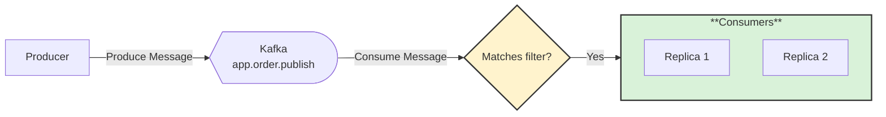
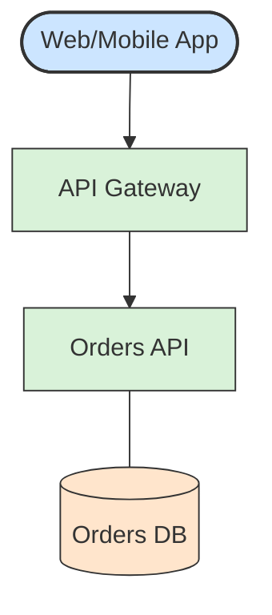

# Mermaid diagram for recipes

## Rules

- Mermaid only, inside a ```` ```mermaid ```` fence under `## 📊 Diagram`.
- `flowchart LR` for message flows, `flowchart TD` for topologies.
- Bold subgraph labels, labelled edges, one `classDef` per role.

## Palette

| Role | Fill |
|------|------|
| Service / group | `#d9f2d9` |
| Data store / page | `#ffe5cc` |
| Interface / component | `#cce5ff` |
| Decision | `#fff3cd` |
| Processor (filter, aggregator) | `#f2e6d9` |
| Outer network container | `#fff9c4` |

Stroke is `#333`.

## Message flow example



## Topology example



## Checklist

1. Every node has a readable label; no raw IDs.
2. Every edge describes the action or protocol where it helps.
3. Colors come from the palette only.
4. Diagram renders in the Mermaid preview.
