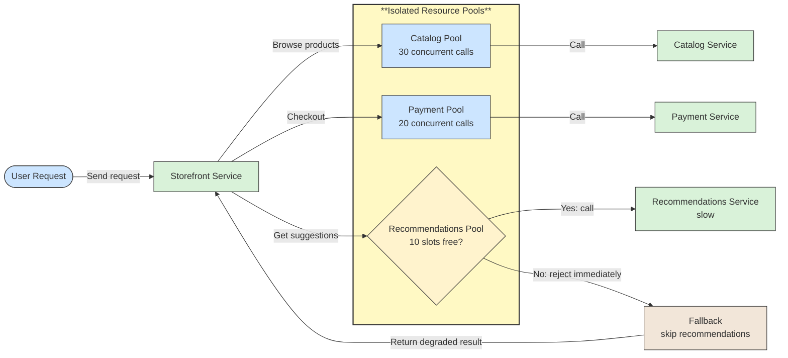

# 🔗 Recipe: Bulkhead Isolation

## 📖 Problem
Services often share resources such as thread pools, connection pools, memory, or CPU. When one dependency or workload becomes slow or floods the service, it can consume all of a shared resource. Unrelated features then starve, even though their own dependencies are healthy, and a partial failure becomes a full outage.

The **Bulkhead Isolation** pattern partitions resources into separate pools, like the watertight compartments of a ship's hull. Each workload, dependency, or client class gets its own limit, so exhausting one pool does not take down the others.

- Contains failures and slowness to the affected partition.
- Keeps critical functions available when less important ones are overloaded.
- Makes resource allocation per dependency or workload explicit.
- Provides clear limits to measure and tune.

---

## 🛍️ Case Study: Storefront Calling Several Dependencies
A Storefront service calls the Catalog, Recommendations, and Payment services. Recommendations becomes slow, and its calls hold on to the shared HTTP connections and request threads. Soon, product browsing and checkout stall too, although Catalog and Payment are healthy.

- **Storefront Service** → Handles user requests and calls several dependencies.
- **Catalog Pool** → Dedicated capacity for catalog reads.
- **Payment Pool** → Dedicated, protected capacity for checkout.
- **Recommendations Pool** → Small, bounded capacity for a non-critical feature.
- **Dependencies** → Catalog, Payment, and Recommendations services, each reached only through its own pool.

---

## 🛍️ Application Context
A bulkhead limits how much of a resource a partition may use. When the partition is full, new calls are rejected or queued briefly instead of taking capacity from other partitions.

Common forms of isolation:

- **Thread-pool isolation** → Each dependency runs on its own thread pool. It provides strong separation and timeouts, at the cost of thread overhead.
- **Semaphore isolation** → A counter limits concurrent calls per dependency on the calling thread. It is lightweight and fits async code well.
- **Connection-pool isolation** → Separate HTTP or database connection pools per dependency or tenant.
- **Process, pod, or deployment isolation** → Critical and non-critical workloads run in separate instances, with their own CPU and memory requests and limits.
- **Queue or consumer isolation** → Separate queues and consumer groups per workload, so a backlog in one does not delay others.
- **Tenant or client-tier isolation** → Premium or noisy tenants get their own capacity so they cannot starve others.

For example, if Storefront allows 10 concurrent calls to Recommendations, 30 to Catalog, and 20 to Payment, a slow Recommendations service fills only its own 10 slots. The next Recommendations call is rejected immediately and the page renders without suggestions, while browsing and checkout continue.

A bulkhead limits **concurrency and resource use**, which differs from related patterns:

- **Rate Limiting** → Controls how many requests per time period a caller may make; see [Rate Limiting](../rate-limiting/README.md). A bulkhead limits how many are in flight at once.
- **Circuit Breaker** → Stops calling a dependency that is failing; see [Circuit Breaker](../circuit-breaker/README.md). A bulkhead limits damage while it is still being called. They are often combined: the bulkhead bounds resource use and the breaker reacts to failures.

---

## ⚙️ General Practices
- **Partition by failure domain** → Separate by dependency, workload type, or tenant tier, according to what could fail or overload independently.
- **Protect critical paths first** → Reserve capacity for essential flows such as checkout and give optional features small limits.
- **Size from data** → Derive limits from expected concurrency (throughput × latency) and observed load, not guesses. Review them as traffic changes.
- **Fail fast when full** → Reject or use a fallback instead of queueing without bound; keep any queue short and capped.
- **Always set timeouts** → A call that never returns holds its slot forever, defeating the bulkhead.
- **Define the fallback** → Decide what the user sees when a partition is full, such as cached data, a degraded page, or a clear error.
- **Combine with other resilience patterns** → Use alongside timeouts, circuit breakers, and rate limiting, and avoid retries that amplify load on a full partition.
- **Avoid too many tiny partitions** → Overly fine partitions waste idle capacity and are hard to tune; balance isolation against utilization.
- **Isolate at the infrastructure level too** → Use separate pods, node pools, and Kubernetes CPU and memory limits so noisy workloads cannot exhaust a node.
- **Monitor saturation and rejections** → Track in-use slots, queue depth, and rejected calls per partition to see which one is under pressure.

---

## 📊 Diagram

