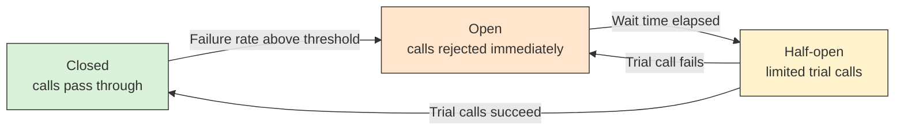
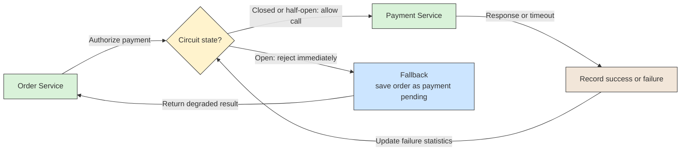

# 🔗 Recipe: Circuit Breaker

## 📖 Problem
When a service calls a dependency that is slow or failing, callers keep sending requests and waiting for timeouts. Threads, connections, and queues fill up, latency grows, and the failure spreads to the callers and then to their own callers. A struggling dependency also receives more load exactly when it needs room to recover.

The **Circuit Breaker** pattern wraps calls to a dependency in a component that tracks recent failures. Once failures pass a threshold, the breaker **opens** and rejects calls immediately instead of attempting them. After a wait, it lets a few trial calls through to check whether the dependency has recovered.

- Fails fast instead of waiting on a dependency that is likely to fail.
- Limits cascading failures and resource exhaustion in the caller.
- Gives the failing dependency time to recover.
- Provides a clear place to apply a fallback.

---

## 🛍️ Case Study: Order Checkout Calling Payments
The Order service calls the Payment service to authorize a charge during checkout. During a Payment outage, each call waits for its timeout, and Order's request threads pile up.

- **Order Service** → Calls Payment through a circuit breaker.
- **Circuit Breaker** → Counts failures and slow calls, and decides whether to allow, reject, or probe.
- **Payment Service** → The dependency that may be slow or unavailable.
- **Fallback** → What Order does when the call is rejected, such as saving the order as pending payment or showing a clear error.

---

## 🛍️ Application Context
The breaker has three states:

- **Closed** → Calls pass through normally while the breaker records failures and slow calls. If the failure rate crosses the configured threshold within a window, it opens.
- **Open** → Calls are rejected immediately without contacting the dependency. After a configured wait time, the breaker moves to half-open.
- **Half-open** → A limited number of trial calls are allowed. If they succeed, the breaker closes. If they fail, it opens again and the wait restarts.

For example, if more than half of the last 20 payment calls fail or time out, the breaker opens for 30 seconds. During that time, checkout immediately saves the order as "payment pending" and returns, instead of holding a thread for several seconds per request. After 30 seconds, a few trial calls go through; if they succeed, normal traffic resumes.

The breaker protects the **caller** and the dependency from overload. It does not make the dependency reliable, so decide up front what the business should do while it is open:

- **Fail with a clear error** → Appropriate when the operation cannot proceed without the dependency.
- **Use a fallback** → For example cached data, a default value, or a degraded feature.
- **Defer the work** → Record the request and process it later, for example through a queue or a [Saga](../saga-pattern/README.md) step that waits and retries.

A circuit breaker works alongside other resilience patterns. Timeouts decide when a single call counts as failed; retries with backoff handle brief faults, but should not hammer an open circuit; bulkheads limit how many resources one dependency can use. For asynchronous consumers, a breaker can pause consumption while a downstream is down, and messages that keep failing can still go to a [Dead Letter Queue](../../asynchronous-communication/dead-letter-queue/README.md).

---

## ⚙️ General Practices
- **Set timeouts on every call** → Without a timeout, a hung call is never counted as a failure and the breaker cannot react.
- **Count slow calls, not only errors** → Treat calls above a latency threshold as failures, since slowness is what exhausts resources.
- **Trip on rates over a window** → Use a failure percentage with a minimum number of calls, so one failure at low traffic does not open the circuit.
- **Distinguish failure types** → Count timeouts, connection errors, and server errors; do not count client errors such as validation failures or business results like "payment declined".
- **Use one breaker per dependency** → Keep breakers separate so one failing service does not block calls to healthy ones, and tune thresholds for each.
- **Limit trial calls in half-open** → Allow only a few probes so a recovering service is not flooded.
- **Retry carefully** → Put retries inside the breaker's accounting, use backoff and jitter, and stop retrying when the circuit is open.
- **Define the fallback deliberately** → Make the behavior while open a business decision, and make it safe to repeat.
- **Monitor state changes** → Log and alert when a breaker opens or closes, and expose its state in metrics so operators see which dependency is failing.

---

## 📊 Diagram

### Breaker States
The breaker moves between three states based on recent call outcomes and a wait timer.

### Call Flow
The caller sends every request through the breaker, which either forwards it or rejects it and triggers the fallback.

