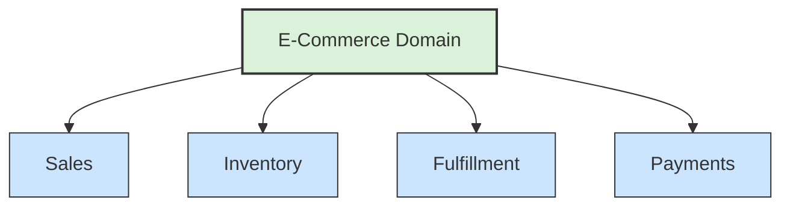
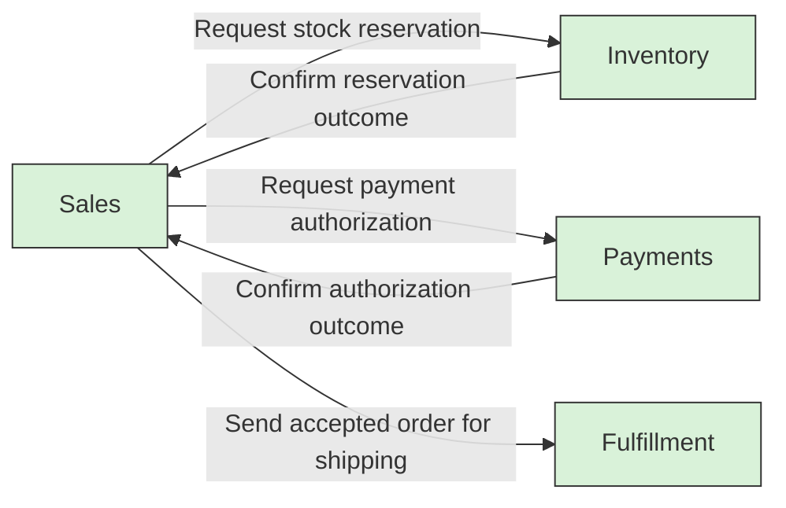

# 🧭 Domain and Subdomains

## 📖 Concept
The **domain** is the area of business the software serves. A **subdomain** is a distinct part of that business, such as sales, inventory, or fulfillment. Identifying subdomains helps teams understand the problem before choosing software boundaries.

Subdomains are discovered by examining business responsibilities and rules. They are not automatically services, teams, or deployment units; those decisions can be made later.

## 🔎 How to Identify Them
Start with the business problem the organization exists to solve, not its current application or org chart. Ask domain experts:

- **What outcome does the business provide, and for whom?** This sets the domain's scope.
- **What distinct capabilities are needed to deliver that outcome?** Each capability may point to a subdomain, such as selling products, managing stock, or fulfilling deliveries.
- **Does the capability have its own business rules and decisions?** Different policies, constraints, and measures of success can indicate a meaningful boundary.
- **Do the concepts or terms change meaning across the capability?** Different meanings may indicate separate models; investigate whether they belong in separate bounded contexts later.
- **How does this capability create or protect business value?** Use this to classify its strategic importance, not to decide its software deployment.

Treat these as discovery prompts, not mechanical rules. A different team, database table, workflow, or department alone does not prove there is a separate subdomain. Validate candidate boundaries with domain experts, and revisit them as understanding improves.

## 🧭 Subdomain Types
DDD commonly distinguishes subdomains by their strategic importance:

- **Core** → The capability that differentiates the business or gives it a competitive advantage. Invest in understanding and modeling it carefully.
- **Supporting** → Necessary for the business, but not itself a source of differentiation. Build or adapt it to support the core.
- **Generic** → A common capability that does not need a unique business model, such as standard authentication or commodity document storage. Consider an existing product or service when appropriate.

These labels depend on the organization and can change over time. A capability that is generic for one business may be core to another.

## 🔗 Interdependencies
Subdomains often depend on one another to complete a business outcome. Map these dependencies after identifying the candidate capabilities, but do not treat every dependency as a reason to merge them: separate capabilities can collaborate while owning different rules and data.

For each dependency, ask:

- **What business information or outcome is needed?** Describe the dependency in business terms, such as Sales needing to know whether Inventory can reserve an item.
- **Who owns the decision and data?** The subdomain that owns a rule should remain authoritative for it; a dependent subdomain should request an outcome rather than reach in and change its data.
- **Which direction does the dependency flow?** Record which capability needs a decision or information from the other. This reveals upstream/downstream relationships to examine during context mapping.
- **How tightly coordinated are the capabilities?** Frequent synchronous decisions, shared rules, or coordinated changes may indicate strong coupling and deserve closer boundary analysis. Occasional notifications or independent work may indicate looser coupling.
- **What happens when the dependency is unavailable or delayed?** The business may need to wait, use a temporary state, retry, or continue with an eventual update.

Use the dependency map to expose ownership and coordination needs, not to prescribe services or a specific communication technology. If two candidate subdomains have inseparable rules and constantly make decisions together, reconsider whether the boundary is meaningful; if they exchange information but retain distinct responsibilities, they can remain separate.

## 🛍️ Example
For an online retailer, the broader e-commerce domain includes sales, inventory, payments, and fulfillment. Each subdomain solves a different business problem and can have its own terminology and rules. If the retailer competes through personalized product discovery, that capability may be core; standard authentication may be generic. The classification should reflect this retailer's strategy, not a universal e-commerce taxonomy.

Sales may ask Inventory to reserve stock, and Fulfillment may need confirmation that an order is ready to ship. These are dependencies, not shared ownership: Inventory decides stock availability, while Sales owns order acceptance and Fulfillment owns shipment execution.

## 📊 Diagram
The domain contains distinct business areas. Their boundaries are discovered from the business, not prescribed by a particular deployment architecture.



### Interdependency View
These arrows show example business dependencies, not ownership transfers or required service boundaries.



## 🧱 Physical C# Project Example
Subdomains are business concepts, not project names. In this example, Sales and Inventory are modeled as bounded contexts and happen to have separate project groups; another system might keep several subdomains inside one context and project.

```text
ECommerce.sln
src/
├── Sales/
│   ├── ECommerce.Sales.Domain/
│   ├── ECommerce.Sales.Application/
│   └── ECommerce.Sales.Api/
└── Inventory/
    ├── ECommerce.Inventory.Domain/
    ├── ECommerce.Inventory.Application/
    └── ECommerce.Inventory.Api/
```

For example, stock-reservation rules belong to `ECommerce.Inventory.Domain`, even when a Sales use case requests a reservation. The number and arrangement of `.csproj` files should follow the model's complexity and deployment needs, not be mechanically derived from the list of subdomains.

**Next** → [Ubiquitous Language](./02-ubiquitous-language.md)
