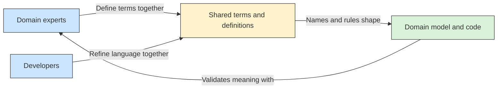

# 🗣️ Ubiquitous Language

## 📖 Concept
A **ubiquitous language** is the shared vocabulary that domain experts and developers use when discussing and modeling a particular domain. The terms should have precise meanings in context and appear consistently in conversations, documentation, and code.

When a term is ambiguous or the software model does not match how the business works, the team clarifies the meaning and updates the language and model together.

## 🛍️ Example
In Sales, the team may define “submitted order” as an order accepted for processing. Using that same term in discussions, documentation, and code helps avoid confusion with a saved cart or an order awaiting customer confirmation.

## 📊 Diagram
Domain experts and developers use the same precise terms within a bounded working context, and those terms are reflected in the model and code.



## 🧱 Physical C# Project Example
Shared business terms should be visible in the names used by a context's code. A simple Sales project might contain:

```text
src/Sales/ECommerce.Sales.Domain/
├── Orders/
│   ├── Order.cs
│   ├── OrderStatus.cs
│   └── OrderLine.cs
└── Carts/
    ├── ShoppingCart.cs
    └── CartItem.cs
```

Names such as `SubmitOrder`, `ReserveStock`, and `OrderStatus.Submitted` should match the definitions agreed with the Sales domain experts. Avoid vague names like `ProcessData` when the business has a more precise term.

**Previous** → [Domain and Subdomains](./01-domain-and-subdomains.md)  
**Next** → [Bounded Context](./03-bounded-context.md)
