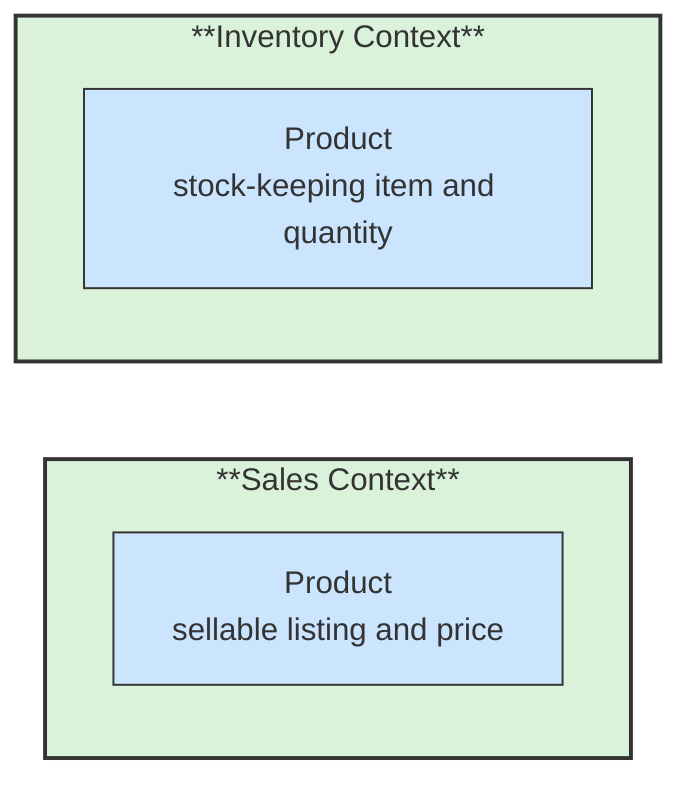

# 🧱 Bounded Context

## 📖 Concept
A **bounded context** is an explicit boundary within which a domain model and its language have a consistent meaning. It defines where a model is valid and who owns its rules.

The same business term can have different representations in different contexts. Those models should not be forced into one universal representation when their responsibilities and rules differ.

## 🛍️ Example
“Product” in Sales may mean a sellable listing with a price and description. “Product” in Inventory may mean a stock-keeping item with a quantity and storage location. Each context uses a model suited to its work.

## 📊 Diagram
Each context owns a coherent model. The same business term can have different representations where the surrounding rules and meaning differ.



## 🧱 Physical C# Project Example
For a modular monolith, separate contexts can be separate project groups in one solution:

```text
src/
├── Sales/
│   ├── ECommerce.Sales.Domain/ECommerce.Sales.Domain.csproj
│   └── ECommerce.Sales.Api/ECommerce.Sales.Api.csproj
└── Inventory/
    ├── ECommerce.Inventory.Domain/ECommerce.Inventory.Domain.csproj
    └── ECommerce.Inventory.Api/ECommerce.Inventory.Api.csproj
```

`Sales.Domain` owns its `Product` model, while `Inventory.Domain` owns its stock item model. Keep them in their own namespaces and projects; do not create one shared `Product` class just because the business uses the same word. Projects are one way to enforce the boundary, but a well-separated module within one project can also represent a context.

**Previous** → [Ubiquitous Language](./02-ubiquitous-language.md)  
**Next** → [Context Mapping](./04-context-mapping.md)
