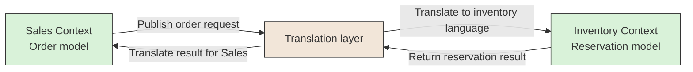

# 🔀 Context Mapping

## 📖 Concept
**Context mapping** describes the relationships and integration choices between bounded contexts. It makes dependencies and translation points visible, including where one context adapts another context's model instead of sharing it directly.

The map helps teams understand which context owns a capability, how information crosses boundaries, and where coupling or mismatched assumptions need attention.

## 🛍️ Example
Sales sends an order request to Inventory. A translation layer maps Sales’ order language to Inventory’s reservation language, then maps the reservation result back for Sales.

## 📊 Diagram
Context mapping makes the relationship between two models explicit. A translation layer can protect one context from adopting another context's language and assumptions.



## 🧱 Physical C# Project Example
Sales owns the translation code for its integration with Inventory. It calls Inventory through a public API or contract and maps the response into a Sales-owned type.

```text
src/Sales/
├── ECommerce.Sales.Application/
│   └── Inventory/
│       └── IStockReservation.cs
└── ECommerce.Sales.Infrastructure/
    └── Integrations/Inventory/
        ├── InventoryReservationClient.cs
        └── InventoryReservationMapper.cs
```

`InventoryReservationClient` translates Sales' request into Inventory's API contract and maps the response back. It should not reference `ECommerce.Inventory.Domain` or reuse Inventory's internal entities; that would couple the contexts' models.

**Previous** → [Bounded Context](./03-bounded-context.md)  
**Next** → [Entity](./05-entity.md)
