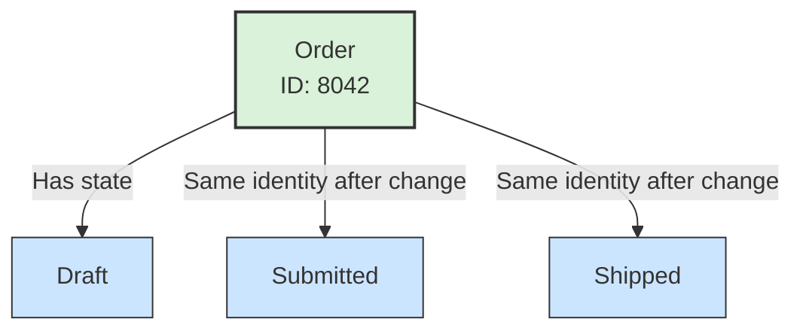

# 🪪 Entity

## 📖 Concept
An **entity** is a domain object defined by its identity and continuity over time, rather than only by its current attributes. An entity can change state and still remain the same entity.

## 🛍️ Example
An order with ID `8042` remains the same order as it moves from Draft to Submitted and then Shipped. Its state and other attributes change, but its identity remains stable.

## 📊 Diagram
An entity has a stable identity through changes to its attributes and state.



## 🧱 Physical C# Project Example
The entity lives in the Domain project for the context that owns its rules. For example, `Order` is a Sales-domain entity:

```text
src/Sales/ECommerce.Sales.Domain/
└── Orders/
    ├── Order.cs
    └── OrderId.cs
```

```csharp
public sealed class Order
{
    public Guid Id { get; private set; }
    public OrderStatus Status { get; private set; }

    public void Submit()
    {
        if (Status != OrderStatus.Draft)
            throw new InvalidOperationException("Only a draft order can be submitted.");

        Status = OrderStatus.Submitted;
    }
}
```

The identity (`Id`) remains stable while `Status` changes. In a real project, the constructor and identifier type would also be designed to prevent invalid creation and support the persistence approach.

**Previous** → [Context Mapping](./04-context-mapping.md)  
**Next** → [Value Object](./06-value-object.md)
