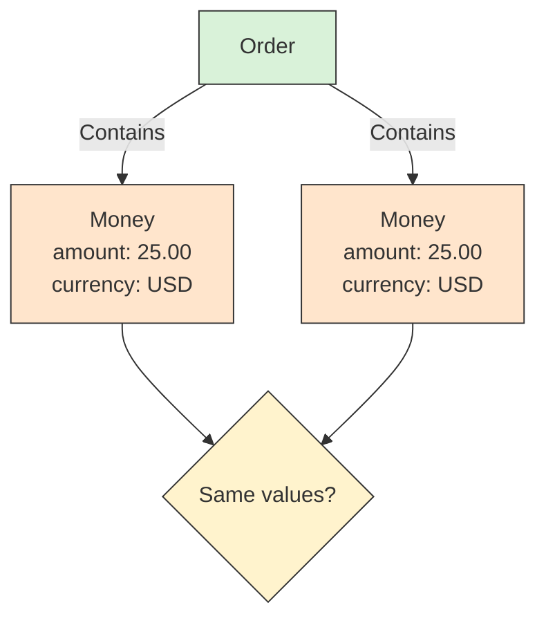

# 💎 Value Object

## 📖 Concept
A **value object** is defined by its values rather than a distinct identity. It is commonly immutable and can express concepts such as money, an address, or a quantity with its unit.

Two value objects with equivalent values are interchangeable in the domain. Replacing one with an equal value does not change the identity of the object that contains it.

## 🛍️ Example
Two `Money` values with amount `25.00` and currency `USD` represent the same value. The currency is part of the value: `25.00 USD` is not equal to `25.00 EUR`.

## 📊 Diagram
Value objects are compared by their values. A value can be replaced with an equivalent value without changing the identity of an owning entity.



## 🧱 Physical C# Project Example
A value object belongs in the domain project of the context that defines its meaning. For Sales:

```text
src/Sales/ECommerce.Sales.Domain/
├── Orders/
│   └── Order.cs
└── Shared/
    └── Money.cs
```

```csharp
public sealed record Money(decimal Amount, string Currency);
```

As a record, `Money` is compared by its values. A production implementation would normally validate that the amount and currency are valid and would use a constrained currency type rather than an arbitrary string.

**Previous** → [Entity](./05-entity.md)  
**Next** → [Aggregate and Aggregate Root](./07-aggregate-and-aggregate-root.md)
