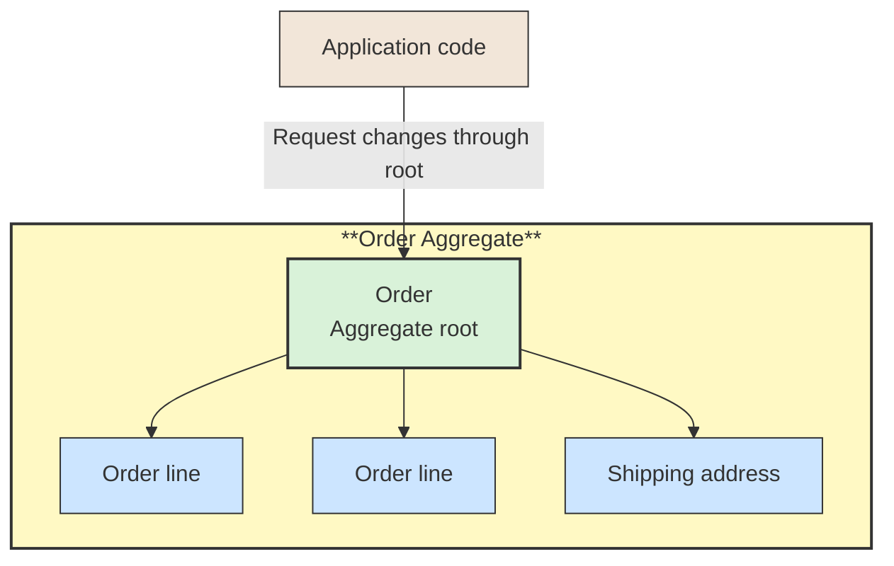

# 🧩 Aggregate and Aggregate Root

## 📖 Concept
An **aggregate** is a cluster of domain objects treated as one consistency boundary. The **aggregate root** is the entry point for changes: callers use it to enforce invariants and protect the aggregate's internal objects.

Keeping the boundary focused helps make transaction scope and consistency rules explicit. Other parts of the model should refer to the aggregate through its root rather than directly modifying its internals.

## 🛍️ Example
An `Order` aggregate can contain order lines and a shipping address. Application code asks the `Order` root to add a line or change the address, allowing it to validate rules such as “a submitted order cannot be edited.”

## 📊 Diagram
The aggregate root guards changes to the aggregate and ensures its invariants are maintained.



## 🧱 Physical C# Project Example
An aggregate and its internal entities are typically ordinary types in the same bounded-context Domain project; they do not need separate `.csproj` files.

```text
src/Sales/ECommerce.Sales.Domain/
└── Orders/
    ├── Order.cs             # Aggregate root
    ├── OrderLine.cs         # Internal entity
    └── ShippingAddress.cs   # Value object
```

```csharp
public sealed class Order
{
    private readonly List<OrderLine> _lines = [];

    public IReadOnlyCollection<OrderLine> Lines => _lines;

    public void AddLine(Guid productId, int quantity)
    {
        if (quantity <= 0)
            throw new ArgumentOutOfRangeException(nameof(quantity));

        _lines.Add(new OrderLine(productId, quantity));
    }
}
```

Application code loads and changes the aggregate through `Order`; it should not load and update an `OrderLine` independently. In this example, `OrderLine` is internal to the aggregate. The exact accessibility and persistence mapping depend on the chosen design.

**Previous** → [Value Object](./06-value-object.md)  
**Next** → [Repository](./08-repository.md)
