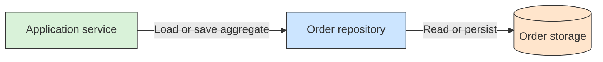

# 🗄️ Repository

## 📖 Concept
A **repository** provides a domain-oriented way to retrieve and persist aggregates without making domain behavior depend directly on storage details. It is not a general-purpose wrapper around every database operation.

Repositories typically provide operations that make sense for the model, such as loading an order by its identity or saving a changed order aggregate.

## 🛍️ Example
An application service requests an order from an `OrderRepository`. The repository handles the underlying storage mechanism and returns the aggregate to the application without exposing database-specific operations to the domain model.

## 📊 Diagram
The repository offers domain-level access to aggregates while hiding the details of how they are stored.



## 🧱 Physical C# Project Example
The repository abstraction is commonly declared with the domain model, and its storage implementation lives in Infrastructure:

```text
src/Sales/
├── ECommerce.Sales.Domain/
│   └── Orders/IOrderRepository.cs
└── ECommerce.Sales.Infrastructure/
    └── Persistence/OrderRepository.cs
```

```csharp
// ECommerce.Sales.Domain
public interface IOrderRepository
{
    Task<Order?> FindByIdAsync(Guid id, CancellationToken cancellationToken);
    Task SaveAsync(Order order, CancellationToken cancellationToken);
}
```

The interface speaks in terms of the Sales aggregate. `OrderRepository.cs` implements it in Infrastructure using the chosen database; the domain model does not depend on Entity Framework or a particular database.

**Previous** → [Aggregate and Aggregate Root](./07-aggregate-and-aggregate-root.md)  
**Next** → [Domain Service](./09-domain-service.md)
