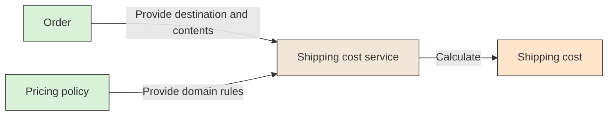

# ⚙️ Domain Service

## 📖 Concept
A **domain service** expresses a domain operation that does not naturally belong to one entity or value object. It contains domain behavior, not infrastructure concerns such as HTTP handling or database access.

A domain service is useful when a meaningful operation involves multiple domain concepts but assigning it to one of them would make the model misleading.

## 🛍️ Example
A shipping-cost calculation may depend on an order's destination and contents as well as a pricing policy. A `ShippingCostService` can express that domain operation without making the order responsible for unrelated pricing rules.

## 📊 Diagram
A domain service performs a business operation using domain concepts when the behavior does not belong naturally to one entity or value object.



## 🧱 Physical C# Project Example
Place domain behavior in the Domain project. If shipping cost is a business calculation, the service and its inputs/outputs belong with the Sales model:

```text
src/Sales/ECommerce.Sales.Domain/
└── Shipping/
    ├── ShippingCostService.cs
    └── ShippingQuote.cs
```

```csharp
public sealed class ShippingCostService
{
    public Money Calculate(decimal weightKg, decimal ratePerKg)
    {
        if (weightKg <= 0)
            throw new ArgumentOutOfRangeException(nameof(weightKg));
        if (ratePerKg < 0)
            throw new ArgumentOutOfRangeException(nameof(ratePerKg));

        return new Money(weightKg * ratePerKg, "USD");
    }
}
```

This simplified example applies a rate to a shipment's weight. A real policy may include destination, package dimensions, and currency rules. A domain service should not call HTTP, query the database, or depend on a framework; an application service can supply the required domain inputs.

**Previous** → [Repository](./08-repository.md)  
**Next** → [Application Service](./10-application-service.md)
