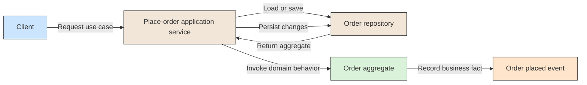

# 🧭 Application Service

## 📖 Concept
An **application service** coordinates a use case: it loads the required domain objects, invokes domain behavior, and manages the interaction with infrastructure. It should orchestrate domain rules rather than become their home.

It provides an entry point for an application action and coordinates its steps. Business decisions and invariants remain in the domain model.

## 🛍️ Example
For a “place order” use case, an application service loads the order, asks the order aggregate to place it, and persists the resulting change. It coordinates the operation but does not itself decide whether the order satisfies the business rules.

## 📊 Diagram
An application service coordinates a use case and delegates business decisions to the domain model.



## 🧱 Physical C# Project Example
The use-case handler belongs in the Application project. It coordinates the repository and calls behavior on the domain aggregate:

```text
src/Sales/ECommerce.Sales.Application/
└── Orders/
    └── SubmitOrder/
        ├── SubmitOrderCommand.cs
        └── SubmitOrderHandler.cs
```

```csharp
public sealed class SubmitOrderHandler(IOrderRepository orders)
{
    public async Task Handle(Guid orderId, CancellationToken cancellationToken)
    {
        var order = await orders.FindByIdAsync(orderId, cancellationToken)
            ?? throw new InvalidOperationException("Order was not found.");

        order.Submit();
        await orders.SaveAsync(order, cancellationToken);
    }
}
```

`SubmitOrderHandler` coordinates the use case; `Order.Submit()` enforces the business rule. The API project can call this handler, while the Application project depends on domain abstractions rather than database details.

**Previous** → [Domain Service](./09-domain-service.md)  
**Next** → [Domain Event](./11-domain-event.md)
