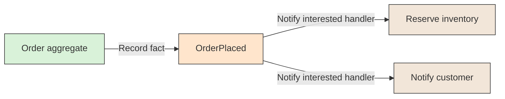

# 📣 Domain Event

## 📖 Concept
A **domain event** is an immutable statement that something meaningful has happened in a domain, such as an order being placed. It describes a fact in the past and can be handled by other parts of the system without making the originating model responsible for their internal work.

Events make meaningful changes explicit. When used across process or service boundaries, reliable publication and delivery need to be handled by the surrounding architecture.

## 🛍️ Example
When an order is placed, the domain records an `OrderPlaced` event. Interested handlers can reserve inventory or notify the customer without adding those responsibilities to the order aggregate.

## 📊 Diagram
A domain event records a meaningful fact in the past. It can be handled by other parts of the system without coupling the originating model to those handlers.



## 🧱 Physical C# Project Example
The event type belongs to the domain that owns the fact. The aggregate records it; the application layer can collect pending events and infrastructure can publish them.

```text
src/Sales/
├── ECommerce.Sales.Domain/
│   └── Orders/Events/OrderPlaced.cs
├── ECommerce.Sales.Application/
│   └── Orders/SubmitOrder/SubmitOrderHandler.cs
└── ECommerce.Sales.Infrastructure/
    └── Messaging/DomainEventPublisher.cs
```

```csharp
// ECommerce.Sales.Domain
public sealed record OrderPlaced(Guid OrderId, DateTimeOffset OccurredAt);
```

`OrderPlaced` describes a Sales fact. Inventory can react through a public integration contract or message; it should not reference or handle Sales' internal domain classes directly. Reliable publication across process boundaries usually requires an outbox or another delivery strategy.

**Previous** → [Application Service](./10-application-service.md)
