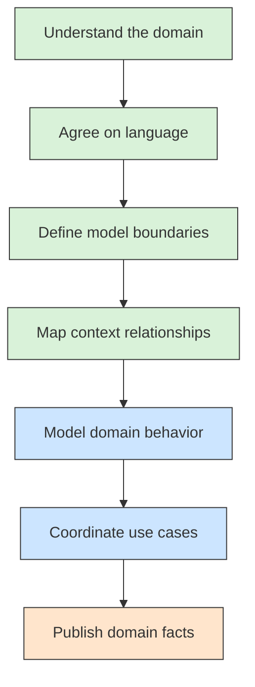

# 🔗 Recipe: Domain-Driven Design

## 📖 Problem
Complex software often fails to reflect the business it is meant to support. The same business term can mean different things to different teams, and domain rules become scattered across services, data models, and user interfaces.

**Domain-Driven Design (DDD)** is an approach to developing software around a deep understanding of its business domain. It gives domain experts and developers a shared way to describe the problem, divide it into explicit models, and keep important business rules close to the code that enforces them.

- Aligns software models and boundaries with the business.
- Makes domain rules explicit and easier to evolve.
- Helps teams separate large domains into models with clear relationships.

---

## 🛍️ Case Study: E-Commerce
An online retailer needs to manage orders, stock, payments, and delivery. Although the same words may appear across the business, each area has its own rules and model.

- **Sales** → Accepts orders and manages order status.
- **Inventory** → Tracks available stock and reservations.
- **Payments** → Authorizes charges and handles refunds.
- **Fulfillment** → Packs and ships accepted orders.

---

## 🛍️ Application Context
DDD is useful when business rules are complex, change often, or are hard to capture in a technical data model alone. Domain experts and developers work together to identify the language, rules, and boundaries that the software should represent.

DDD is an approach, not a requirement to use microservices: a bounded context can be implemented as a module, a service, or another suitable deployment unit. The concepts below are organized as a learning path, from understanding the business to modeling behavior and coordinating use cases.

---

## 🧭 Learning Path
Read the concepts in order. Each page introduces one idea, gives an e-commerce example, and includes a diagram.

### Strategic Design
1. [Domain and Subdomains](./01-domain-and-subdomains.md) → Identify the business area and its distinct responsibilities.
2. [Ubiquitous Language](./02-ubiquitous-language.md) → Build a precise shared vocabulary with domain experts.
3. [Bounded Context](./03-bounded-context.md) → Define where a model and its language have consistent meaning.
4. [Context Mapping](./04-context-mapping.md) → Make relationships and translations between contexts explicit.

### Tactical Design
5. [Entity](./05-entity.md) → Model objects that have identity and continuity over time.
6. [Value Object](./06-value-object.md) → Model concepts defined by their values rather than identity.
7. [Aggregate and Aggregate Root](./07-aggregate-and-aggregate-root.md) → Protect invariants within a consistency boundary.
8. [Repository](./08-repository.md) → Retrieve and persist aggregates through a domain-oriented abstraction.
9. [Domain Service](./09-domain-service.md) → Express domain behavior that does not belong to one object.
10. [Application Service](./10-application-service.md) → Coordinate a use case without owning its business rules.
11. [Domain Event](./11-domain-event.md) → Represent an important fact and notify interested parts of the system.

---

## ⚙️ General Practices
- **Model the business, not just the data** → Capture important behavior, rules, and constraints alongside domain concepts.
- **Use language consistently within a context** → Make terms precise, and allow different contexts to use different models when meanings differ.
- **Discover boundaries with domain experts** → Base subdomains and bounded contexts on business responsibilities, not only technical layers.
- **Protect aggregate invariants** → Route changes through the aggregate root and keep transactions within the aggregate's consistency boundary where practical.
- **Keep persistence and orchestration concerns out of domain rules** → Use repositories and application services to connect the model to infrastructure and use cases.
- **Treat context integration as an explicit design choice** → Document ownership, translations, and dependencies between bounded contexts.
- **Adopt DDD selectively** → Apply its modeling effort where domain complexity justifies it; simple parts of a system may need less.

---

## 📊 Diagram
The learning path starts with strategic design to understand the domain and its boundaries, then moves to tactical building blocks for expressing and coordinating domain behavior.



## 🧱 Physical C# Project Example
Here is one possible solution layout for the e-commerce example. The projects represent two bounded contexts; this is a modular-monolith option and does not require each context to run as a separate service.

```text
ECommerce.sln
src/
├── Sales/
│   ├── ECommerce.Sales.Api/
│   ├── ECommerce.Sales.Application/
│   ├── ECommerce.Sales.Domain/
│   └── ECommerce.Sales.Infrastructure/
└── Inventory/
    ├── ECommerce.Inventory.Api/
    ├── ECommerce.Inventory.Application/
    ├── ECommerce.Inventory.Domain/
    └── ECommerce.Inventory.Infrastructure/
```

Typical project references point inward: `Sales.Api` uses `Sales.Application`; `Sales.Application` uses `Sales.Domain`; and `Sales.Infrastructure` implements persistence and integration details for Sales. Inventory has the same internal separation. Sales integrates with Inventory through its public contract or API, not by referencing Inventory's domain project.

This layout is a physical choice, not the definition of DDD boundaries. A small application could keep a bounded context in a single project with folders, while a larger one may split the layers into projects.
