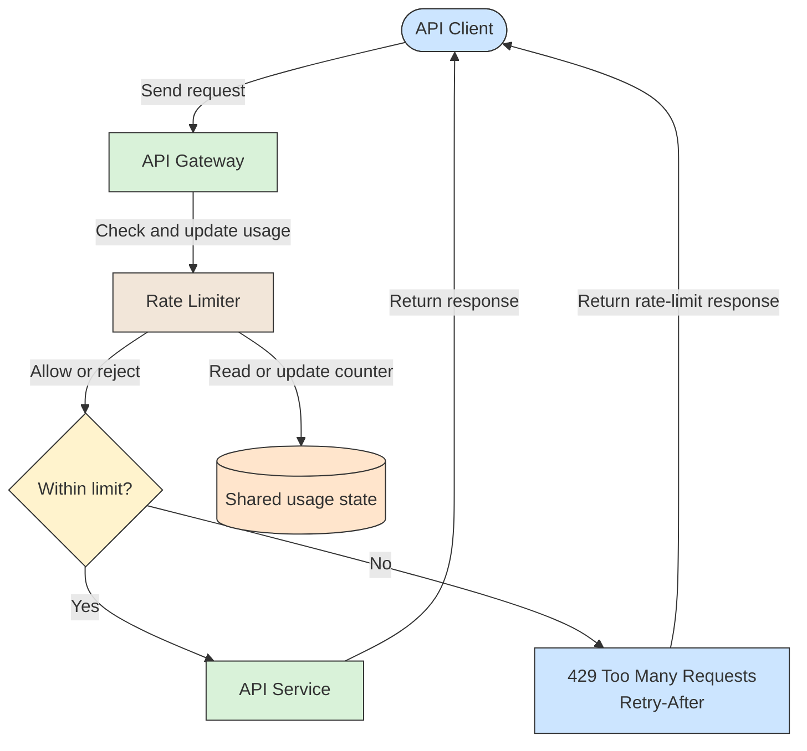

# 🔗 Recipe: Rate Limiting

## 📖 Problem
An API or service can receive more requests than it can process, whether from bursts of legitimate traffic, a faulty client, or abuse. Without a limit, excess work consumes connections, CPU, and downstream capacity, increasing latency and potentially making the service unavailable to everyone.

The **Rate Limiting** pattern controls how many requests a client or other identified caller can make in a period. When the limit is reached, the system rejects or delays further requests, preserving capacity for allowed traffic.

- Protects services and dependencies from overload.
- Allocates capacity fairly across clients or users.
- Makes usage limits explicit and predictable.
- Provides a control point for abuse prevention and quota enforcement.

---

## 🛍️ Case Study: Public API
A public API serves multiple customer applications through an API gateway. One client begins sending a burst of requests that consumes too much capacity, affecting other clients.

- **Client** → Sends requests with an identity such as an API key or authenticated user ID.
- **API Gateway** → Applies the configured rate limit before forwarding requests.
- **Rate Limiter** → Tracks the client's usage and decides whether each request is within its limit.
- **API Service** → Processes requests allowed by the gateway.

---

## 🛍️ Application Context
A rate limit is usually defined by a **key**, a **limit**, and a **time window**. For example, a client might be allowed 100 requests per minute. The key can identify an API key, user, tenant, IP address, or a combination; choose it to match the fairness and security boundary required by the product.

When a request arrives, the limiter checks and updates usage atomically. If the request is within the limit, it forwards it to the API. Otherwise it rejects the request, commonly with HTTP `429 Too Many Requests` and a `Retry-After` header when the retry time is known.

The algorithm affects how bursts behave:

- **Fixed window** → Counts requests in fixed time intervals. It is simple, but a caller can burst near the end of one window and the start of the next.
- **Sliding window** → Tracks usage over a rolling interval, smoothing the fixed-window boundary effect at the cost of more state or computation.
- **Token bucket** → Adds tokens at a configured rate and allows a bounded burst while tokens are available. This is a common choice when short bursts are acceptable.
- **Leaky bucket** → Processes requests at a steady rate, smoothing bursts; excess requests are queued or rejected when the queue is full.

For a distributed service, all instances enforcing the same limit need a consistent view of usage. A shared store or gateway-level limiter can coordinate counters, but updates must be atomic and the added dependency and latency should be considered. Define what happens if that store is unavailable: fail open to preserve availability, or fail closed to preserve the quota and protection.

Rate limiting controls admission; it does not increase capacity or guarantee fair scheduling after requests are admitted. Use backpressure or queues when work should wait rather than be rejected, and apply timeouts and concurrency limits to protect dependencies independently.

---

## ⚙️ General Practices
- **Choose the right identity key** → Prefer authenticated user, tenant, or API key when available; IP-based limits can group many legitimate users behind one address or be evaded through address rotation.
- **Define the policy per operation** → Expensive endpoints may need stricter limits than lightweight reads, and account tiers may need different quotas.
- **Use an algorithm that fits traffic** → Select fixed or sliding windows, token bucket, or leaky bucket based on whether boundary bursts, short bursts, or steady throughput matter most.
- **Update shared state atomically** → Concurrent requests and multiple service instances must not overspend the same quota.
- **Return actionable responses** → Use HTTP 429 and include `Retry-After` or limit/reset headers when the policy can provide them.
- **Bound burst and queue capacity** → A rate limit should not allow a sudden burst that overwhelms downstream services; if requests are queued, cap the queue and define overflow behavior.
- **Coordinate client retries** → Encourage clients to respect retry guidance and use exponential backoff with jitter instead of immediately repeating rejected requests.
- **Decide store-failure behavior** → Explicitly choose fail-open or fail-closed behavior based on whether availability or strict enforcement is more important.
- **Monitor rejections and latency** → Track allowed and rejected requests by policy and key dimensions, while avoiding sensitive or high-cardinality labels.

---

## 📊 Diagram

