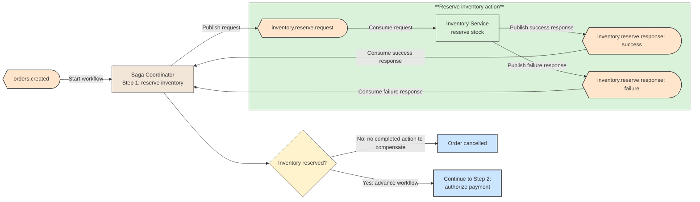
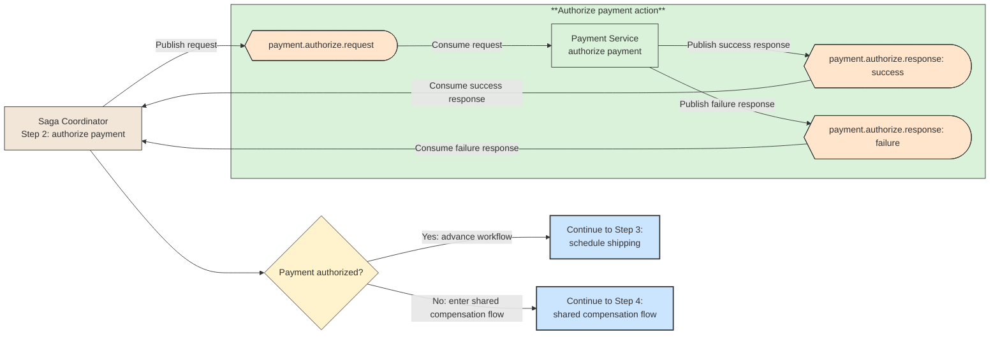
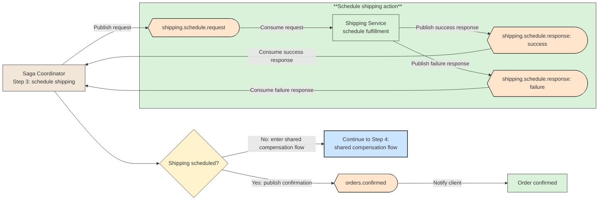
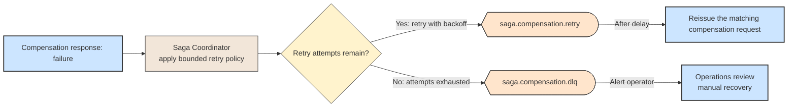

# 🔗 Recipe: Saga Pattern

## 📖 Problem
In a distributed system, one business operation may update data owned by several services. A traditional database transaction cannot normally span those independent databases without tight coupling or distributed transaction infrastructure, so a failure partway through can leave the business process incomplete.

The **Saga pattern** models the operation as a sequence of local transactions. Each service commits its own change, and if a later step fails, the workflow invokes compensating actions for earlier steps.

- Keeps service-owned data within each service's local transaction boundary.
- Makes partial progress and recovery explicit across a long-running workflow.
- Trades global atomicity for eventual consistency and business-level compensation.

---

## 🛍️ Case Study: E-Commerce Order
An order workflow needs to reserve stock, authorize payment, and arrange shipment across independently deployed services.

- **Order Service** → Creates the order and records its workflow state.
- **Saga Orchestrator** → Starts each step, tracks outcomes, retries eligible failures, and requests compensation when needed.
- **Inventory Service** → Reserves stock and can release that reservation as a compensating action.
- **Payment Service** → Authorizes payment and can void or refund it if a later step cannot complete.
- **Shipping Service** → Schedules fulfillment after the required earlier steps succeed.

---

## 🛍️ Application Context
The orchestrator stores the saga's progress so it can resume after transient failures or process restarts. If payment is declined after inventory has been reserved, it can ask Inventory to release the reservation and mark the order as cancelled. A compensation is a new business action, not a literal rollback: a refund, for example, may not erase the original payment record.

In a Kafka-backed implementation, Kafka is the durable event backbone: each action consumes a command topic and publishes a result or failure topic. Retained events and committed offsets support recovery and replay after transient outages. The saga coordinator owns workflow state, correlation, retry policy, and compensation; Kafka transports and retains events but does not perform business rollback.

The same workflow can instead use choreography, where services react to events and publish events that trigger subsequent steps. That can reduce central coordination, but makes the overall flow and failure handling harder to see in one place.

---

## ⚙️ General Practices
- **Design compensations up front** → Define what business action can reverse or offset each completed step, including what happens when compensation itself fails.
- **Make handlers idempotent** → Repeated commands or events should not reserve stock, charge a customer, or compensate more than once.
- **Persist workflow state** → Store progress and outcomes durably so the saga can recover after restarts and expose stuck workflows for intervention.
- **Use reliable event delivery** → Pair state changes and outgoing events with patterns such as the transactional outbox, and expect at-least-once delivery.
- **Set timeouts and retry policies** → Bound transient retries, distinguish permanent business failures, and provide an operational path for workflows that need manual recovery.
- **Avoid promising atomicity** → Communicate intermediate states and eventual outcomes to clients and downstream services.

---

## 📊 Diagram

**Shared compensation flow** → Steps 2 and 3 route failures to Step 4. Each compensating action is shown once there: payment failure releases inventory; shipping failure first voids payment, then releases inventory.

### Step 1: Reserve Inventory

### Step 2: Authorize Payment

### Step 3: Schedule Shipping

### Step 4: Shared Compensation Flow

```mermaid
flowchart LR
    PaymentFailedEntry["Step 2:<br/>payment authorization failed"]
    ShippingFailedEntry["Step 3:<br/>shipping failed"]
    Saga4["Saga Coordinator<br/>select compensation path"]
    Recovery5["Continue to Step 5:<br/>retry or escalate"]
    Cancelled["Order cancelled"]

    subgraph paymentVoidAction["**Compensation: void payment**"]
        direction LR
        VoidRequest@{ shape: curv-trap, label: "payment.void.request" }
        PaymentVoidService["Payment Service<br/>void authorization"]
        VoidSuccess@{ shape: curv-trap, label: "payment.void.response: success" }
        VoidFailure@{ shape: curv-trap, label: "payment.void.response: failure" }
        VoidRequest -- Consume compensation request --> PaymentVoidService
        PaymentVoidService -- Publish success response --> VoidSuccess
        PaymentVoidService -- Publish failure response --> VoidFailure
    end

    subgraph inventoryReleaseAction["**Compensation: release inventory**"]
        direction LR
        ReleaseRequest@{ shape: curv-trap, label: "inventory.release.request" }
        InventoryReleaseService["Inventory Service<br/>release reserved stock"]
        ReleaseSuccess@{ shape: curv-trap, label: "inventory.release.response: success" }
        ReleaseFailure@{ shape: curv-trap, label: "inventory.release.response: failure" }
        ReleaseRequest -- Consume compensation request --> InventoryReleaseService
        InventoryReleaseService -- Publish success response --> ReleaseSuccess
        InventoryReleaseService -- Publish failure response --> ReleaseFailure
    end

    VoidOutcome{"Payment void successful?"}
    ReleaseOutcome{"Inventory release successful?"}
    FailureRoute{"Which forward action failed?"}

    PaymentFailedEntry --> Saga4
    ShippingFailedEntry --> Saga4
    Saga4 --> FailureRoute
    FailureRoute -- Payment authorization failed --> ReleaseRequest
    FailureRoute -- Shipping failed: void payment first --> VoidRequest
    VoidSuccess --> VoidOutcome
    VoidFailure --> VoidOutcome
    VoidOutcome -- Yes: continue compensation --> ReleaseRequest
    VoidOutcome -- No: retry or escalate --> Recovery5
    ReleaseSuccess --> ReleaseOutcome
    ReleaseFailure --> ReleaseOutcome
    ReleaseOutcome -- Yes: required compensations complete --> Cancelled
    ReleaseOutcome -- No: retry or escalate --> Recovery5

    classDef service fill:#d9f2d9,stroke:#333,stroke-width:1px;
    classDef topic fill:#ffe5cc,stroke:#333,stroke-width:1px;
    classDef processor fill:#f2e6d9,stroke:#333,stroke-width:1px;
    classDef decision fill:#fff3cd,stroke:#333,stroke-width:1px;
    classDef interface fill:#cce5ff,stroke:#333,stroke-width:2px;
    class PaymentVoidService,InventoryReleaseService service;
    class Saga4 processor;
    class VoidRequest,VoidSuccess,VoidFailure,ReleaseRequest,ReleaseSuccess,ReleaseFailure topic;
    class VoidOutcome,ReleaseOutcome,FailureRoute decision;
    class PaymentFailedEntry,ShippingFailedEntry,Recovery5,Cancelled interface;
    style paymentVoidAction fill:#f2e6d9,stroke:#333,stroke-width:1px;
    style inventoryReleaseAction fill:#f2e6d9,stroke:#333,stroke-width:1px;
```

### Step 5: Retry or Escalate Compensation
