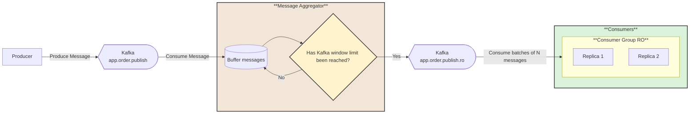

# 📬 Aggregation and Batch Processing

## 📖 Overview
This recipe demonstrates **message aggregation** using Apache Kafka with Streamiz\.Kafka.Net.

The goal is to show how a stream of individual events can be continuously grouped and combined into summarized results, such as counts, totals, or averages, before being published into an output topic. Unlike simple publish/subscribe, where every consumer receives raw events, aggregation enables downstream services to consume pre‑computed insights rather than processing each message independently.

Aggregation via Kafka allows data to be consolidated according to keys or time windows, producing meaningful summaries like “number of orders per region in the last 5 minutes” or “average sensor reading per device.” This pattern is useful for reducing processing overhead, enabling real‑time analytics, and providing services with higher‑level information derived from raw event streams. Streamiz\.Kafka.Net provides a declarative way to implement this logic, grouping records by key, applying aggregation functions, and forwarding the computed results into dedicated topics for downstream consumers.

---

## ⚙️ Functionalities

**📨 Producer**  
- Publishes messages to the main Kafka topic: **`app.order.publish`**  
- Operates independently of consumers, ensuring **decoupling** between message creation and processing  
- Messages are **partitioned** for scalability, allowing horizontal throughput  

---

**🔗 Message Aggregator (Streamiz.Kafka)**  
- A Streamiz.Kafka pipeline consumes from **`app.order.publish`** and buffers incoming messages  
- A **decision node** checks whether the buffer has accumulated **10 messages**  
  - **Yes** → the batch of 10 is published into the regional topic **`app.order.publish.ro`**  
  - **No** → messages remain in the buffer until the threshold is reached  
- This batching logic ensures that consumers receive **aggregated batches** rather than individual events, reducing downstream load and enabling batch‑oriented processing  

---

**👥 Consumers (Consumer Group RO)**  
- A consumer group subscribes to **`app.order.publish.ro`**  
- Multiple replicas (e.g., **Replica 1**, **Replica 2**) process the aggregated batches in parallel  
- Kafka’s consumer group coordination ensures **scalability and fault tolerance**, distributing batches across replicas for balanced processing   


## 📊 Diagram

---

## 🛠️ Technologies Used
This recipe leverages the following technologies:

- **Kafka** → Enables reliable message streaming and communication between producers and consumers.  
- **ASP\.NET and .NET** → Provides the framework for building and running both producer and consumer applications.  
- **Docker** → Creates a containerized environment to simplify setup, testing, and deployment of the recipe. 
- **AKHQ** → Provides an interface for visualizing messages sent via topics in Kafka  

## ▶️ How to Use

Follow these steps to run the recipe locally:

1. **Clone the repository**
   ```bash
   git clone https://github.com/aleczandru1989/architectural-recipes.git.git


2. **Navigate to recipe**
   ```bash
   cd architectural-recipes/asynchronous-communication/aggregation/Kafka


3. **Run Docker Compose** 
   ```bash
   docker compose up -d

4. **Open Producer in Browser**
   ```bash
   - Navigate to: http://localhost:5000/swagger/index.html
   - Use the /api/Order/Send endpoint to post a message with the OrderId being the one used for batch groupping.

5. **Open AKHQ**
   ```bash
   - Navigate to: http://localhost:8080/ui/local-kafka/topic
   - Click on the app.order.publish topic in the Data section to inspect the published messages.

6. **Consumers**
    ```bash
    - Monitor the logs to see that we are receiving messages with batches of 10.