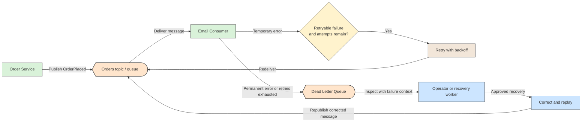

# 🔗 Recipe: Dead Letter Queue

## 📖 Problem
A message can repeatedly fail because it is malformed, violates a business constraint, or triggers a bug in the consumer. Leaving that message on the normal processing path can block progress, consume resources through endless retries, or prevent later messages from being handled.

A **dead letter queue (DLQ)** is a separate destination for messages that the normal processing path cannot successfully handle after the configured delivery and retry policy. It quarantines failed messages so the main workflow can continue while the failure is investigated and resolved.

- Separates repeatedly failing messages from normal traffic.
- Preserves the message and failure context for diagnosis.
- Supports deliberate repair and replay when the cause is understood.

---

## 🛍️ Case Study: Order Confirmation Emails
An order service publishes `OrderPlaced` messages. An email consumer handles them, but a message with an invalid address or an unexpected payload may keep failing.

- **Order Service** → Publishes an order event for asynchronous processing.
- **Message Broker** → Delivers messages and routes exhausted failures to the DLQ according to broker or consumer policy.
- **Email Consumer** → Validates the message and sends the confirmation.
- **Dead Letter Queue** → Retains messages that could not be processed successfully.
- **Operator or Recovery Worker** → Investigates failures and, when safe, corrects or replays messages.

---

## 🛍️ Application Context
The DLQ is a failure-handling destination, not a substitute for retrying transient errors. A consumer may retry temporary failures—such as a short email-provider outage—with a bounded policy and backoff. If delivery attempts are exhausted, or the error is known to be permanent, the message can be moved to the DLQ so unrelated messages continue to flow.

For example, the email consumer rejects an `OrderPlaced` message because its address field is missing. After the configured attempts, the broker or consumer stores the original message together with useful context such as the failure reason, time, source destination, and attempt count. An operator can correct the source data or message according to business policy, then deliberately replay it.

DLQ behavior varies by broker. Some brokers provide native dead-letter routing; others use an application-managed destination such as a separate topic. Configure retention, access controls, alerting, and replay procedures for the chosen platform. Replayed messages may be delivered more than once, so consumers should be idempotent and operators should avoid blindly replaying a large backlog.

---

## 🔀 Example: Saga and Dead Letter Queue
A [Saga](../../architectural-patterns/saga-pattern/README.md) and a DLQ handle different kinds of failure, so they are easy to confuse. Consider an order saga with two steps: reserve stock, then authorize payment.

- **Business failure → compensation, not DLQ** → The Payment service processes the request correctly and replies `PaymentDeclined`. This is a normal result message. The saga reacts by sending `ReleaseStock` to undo the reservation and cancels the order. Nothing is dead-lettered.
- **Technical failure → retry, then DLQ** → The `AuthorizePayment` command arrives malformed, or the consumer keeps crashing on it. The Payment consumer cannot produce any reply, so after bounded retries (or immediately, if the error is permanent) the broker moves the command to the DLQ.
- **The saga is still waiting** → A dead-lettered command means no result will arrive. The saga state stays at `AwaitingPayment`, so a timeout or an alert on the DLQ must trigger a decision: an operator fixes and replays the command, or the saga is failed and compensated.
- **Failed compensation → DLQ** → If `ReleaseStock` keeps failing after its retries, it goes to the DLQ for manual recovery, because there is no further automatic step to fall back to.

Both mechanisms depend on reliable delivery. The saga writes its state change and the next command to the outbox in one transaction (see [Transactional Outbox](../transactional-outbox/README.md)), and consumers must be idempotent because retries and replays can deliver a message more than once.

```mermaid
flowchart LR
    Saga["Saga Coordinator<br/>state: AwaitingPayment"]
    PaymentQueue@{ shape: curv-trap, label: "payment.authorize" }
    Payment["Payment Consumer"]
    Outcome@{ shape: diam, label: "Result?" }
    Declined["PaymentDeclined reply"]
    Compensate["Compensation:<br/>ReleaseStock"]
    DLQ@{ shape: curv-trap, label: "payment.authorize.dlq" }
    Operator["Operator<br/>fix and replay, or fail the saga"]

    Saga -- Send AuthorizePayment --> PaymentQueue
    PaymentQueue -- Deliver command --> Payment
    Payment --> Outcome
    Outcome -- Business failure: declined --> Declined
    Declined -- Reply to saga --> Compensate
    Outcome -- Technical failure: retries exhausted --> DLQ
    DLQ -- Alert, saga still waiting --> Operator
    Operator -- Replay command --> PaymentQueue
    Operator -- Or fail and compensate --> Compensate

    classDef service fill:#d9f2d9,stroke:#333,stroke-width:1px;
    classDef topic fill:#ffe5cc,stroke:#333,stroke-width:1px;
    classDef decision fill:#fff3cd,stroke:#333,stroke-width:1px;
    classDef processor fill:#f2e6d9,stroke:#333,stroke-width:1px;
    classDef interface fill:#cce5ff,stroke:#333,stroke-width:1px;
    class Saga,Payment service;
    class PaymentQueue,DLQ topic;
    class Outcome decision;
    class Compensate processor;
    class Declined,Operator interface;
```

---

## ⚙️ General Practices
- **Retry only when appropriate** → Use bounded retries with backoff for transient faults; route permanent failures or exhausted retries to the DLQ.
- **Preserve failure context** → Keep enough metadata to identify the source, attempts, failure time, and cause without exposing sensitive payload data unnecessarily.
- **Monitor the queue** → Alert on new messages, growth, age, and processing failures so the DLQ does not become an unnoticed message graveyard.
- **Define ownership and recovery** → Document who investigates, how messages are corrected, and who can authorize replay or discard.
- **Make consumers idempotent** → A replay can produce duplicate delivery; guard business side effects against duplicate processing.
- **Choose retention deliberately** → Set retention and access controls to meet operational and data-protection needs.
- **Do not blindly replay poison messages** → Fix the underlying cause or payload first, otherwise the same message may fail again.

---

## 📊 Diagram
Transient failures receive bounded retries. A message that is permanently invalid or continues to fail after the retry policy is exhausted is isolated for investigation and controlled recovery.

