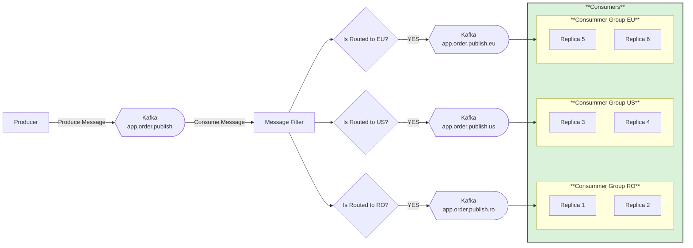

# 📬 Content Based Filtering

## 📖 Overview
This recipe demonstrates **content‑based filtering** using Apache Kafka with Streamiz\.Kafka\.Net.

The goal is to show how a producer can publish all messages into a common Kafka topic, and how a filtering pipeline can route those messages into region‑specific topics based on their content. Unlike publish/subscribe, where every consumer group receives the full stream, filtering ensures that only relevant messages are delivered to each group.

Filtering via Kafka allows messages to be selectively distributed according to attributes such as region, type, or priority. This pattern is useful for targeted event processing, reducing consumer load, and enabling specialized services to react only to the data they care about. Streamiz\.Kafka\.Net provides a declarative way to implement this logic, applying filters and forwarding matching messages into dedicated topics for downstream consumers.


---

## ⚙️ Functionalities

**📨 Producer**
- Publishes messages to the main Kafka topic: **`app.order.publish`**  
- Operates independently of consumers, ensuring **decoupling** between message creation and processing  
- Messages are **partitioned** for scalability, allowing horizontal throughput  


**🔎 Message Filter (Streamiz.Kafka)**
- A Streamiz.Kafka pipeline consumes from **`app.order.publish`** and applies filtering logic  
- Based on message content (e.g., `region` field), the filter routes messages into region‑specific topics:
  - **`app.order.publish.ro`** → Romanian orders  
  - **`app.order.publish.eu`** → European orders  
  - **`app.order.publish.us`** → US orders  
- Decision nodes ensure that only messages matching the condition are forwarded to the respective topic  


**👥 Consumers (Three Consumer Groups: RO, EU, US)**
- Each consumer group subscribes to its **region‑specific topic**  
- Within a group, **two replicas share the workload**:
  - Kafka guarantees that each message is processed by **exactly one replica** in the group  
  - Replicas provide **fault tolerance** — if one fails, the other continues seamlessly  
  - Offset commits are **independent per group**, ensuring reliable delivery and replay isolation  

---

**✅ Pattern Outcome**
Together, the producer, Streamiz.Kafka filter, and consumer groups demonstrate **content‑based filtering in Kafka**:
- One producer sends all messages into a **common topic**  
- Streamiz.Kafka routes messages into **region‑specific topics** based on filter conditions  
- Each consumer group receives **only the relevant stream**, while replicas inside a group balance the work without duplication  


## 📊 Diagram

---

## 🛠️ Technologies Used
This recipe leverages the following technologies:

- **Kafka** → Enables reliable message streaming and communication between producers and consumers.  
- **ASP\.NET and .NET** → Provides the framework for building and running both producer and consumer applications.  
- **Docker** → Creates a containerized environment to simplify setup, testing, and deployment of the recipe. 
- **AKHQ** → Provides an interface for visualizing messages sent via topics in Kafka  

## ▶️ How to Use

Follow these steps to run the recipe locally:

1. **Clone the repository**
   ```bash
   git clone https://github.com/aleczandru1989/architectural-recipes.git.git


2. **Navigate to recipe**
   ```bash
   cd architectural-recipes/asynchronous-communication/filtering/Kafka


3. **Run Docker Compose** 
   ```bash
   docker compose up -d

4. **Open Producer in Browser**
   ```bash
   - Navigate to: http://localhost:5000/swagger/index.html
   - Use the /api/Order/Send endpoint to post a message with the country field set to RO, EU, or US.

5. **Open AKHQ**
   ```bash
   - Navigate to: http://localhost:8080/ui/local-kafka/topic
   - Click on the app.order.publish topic in the Data section to inspect the published messages.

6. **Consumers**
    ```bash
    - Monitor the logs for each consumer group.
   - You will see that only the correctly associated consumer group (RO, EU, or US) consumes the message, based on the filtering logic