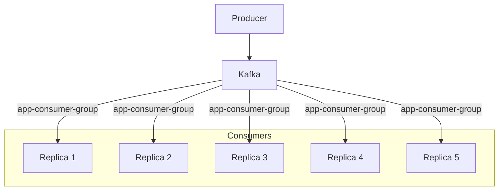

# 📬 Point-to-Point with Kafka

## 📖 Overview
This recipe demonstrates **point-to-point asynchronous communication using Apache Kafka**.  

The goal is to show how a producer can send messages to a Kafka topic, and how consumers can reliably process those messages in a one-to-one delivery model, even when there are multiple replicas of the same services listening.

Point-to-point via Kafka ensures that each message is consumed by exactly one member of a consumer group. This pattern is useful for distributing tasks evenly across multiple replicas while maintaining strict delivery guarantees.

---

## ⚙️ Functionalities
- 📨 **Producer**
  - Publishes messages to a designated Kafka topic.  
  - Operates independently of consumers, ensuring decoupling between message creation and processing.  
  - Can scale horizontally to handle high throughput by partitioning messages across multiple topic partitions.  

- 👥 **Consumers (Consumer Group: `app-consumer-group`)**
  - Five consumer replicas subscribe to the Kafka topic under the same group ID.  
  - Kafka ensures that each message is delivered to **exactly one consumer** within the group.  
  - Workload is balanced across replicas: if one consumer fails, others continue processing seamlessly.  
  - Consumers can commit offsets to track progress and guarantee at-least-once delivery.  

Together, the producer and consumer group demonstrate how Kafka enables reliable point-to-point communication: one producer sends messages, and multiple consumers share the work without duplication.

---

## 📊Diagram

---

## 🛠️ Technologies Used
This recipe leverages the following technologies:

- **Kafka** → Enables reliable message streaming and communication between producers and consumers.  
- **ASP\.NET and .NET** → Provides the framework for building and running both producer and consumer applications.  
- **Docker** → Creates a containerized environment to simplify setup, testing, and deployment of the recipe. 
- **AKHQ** → Provides an interface for visualizing messages send via topics in Kafka  

## ▶️ How to Use

Follow these steps to run the recipe locally:

1. **Clone the repository**
   ```bash
   git clone https://github.com/aleczandru1989/architectural-recipes.git.git


2. **Navigate to recipe**
   ```bash
   cd architectural-recipes/asynchronous-communication/point-to-point/Kafka


3. **Run Docker Compose** 
   ```bash
   docker compose up -d

4. **Open Producer in Browser**
   ```bash
   Open in browser http://localhost:5000/swagger/index.html and post a message via /api/Order/Send

5. **Open AKHQ**
   ```bash
   Open in browser http://localhost:8080/ui/local-kafka/topic and click on app.order.publish topic on data section to see the data.

6. **Consumers**
    ```bash
    Monitor the logs on one of the 5 consumer replicas to see in witch one the message arrived
