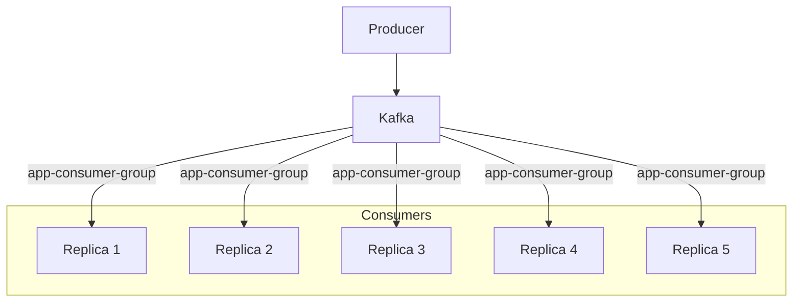

```mermaid
flowchart TD
    Producer["Producer"]
    Kafka["Kafka"]
    
    subgraph replicas["Consumers"]
        C1["Replica 1"]
        C2["Replica 2"]
        C3["Replica 3"]
        C4["Replica 4"]
        C5["Replica 5"]
    end

    Producer --> Kafka
    Kafka --> |app-consumer-group| C1
    Kafka --> |app-consumer-group| C2
    Kafka --> |app-consumer-group| C3
    Kafka --> |app-consumer-group| C4
    Kafka --> |app-consumer-group| C5
```
