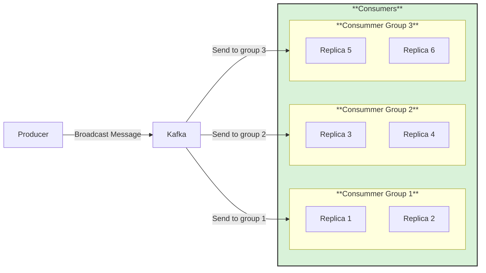

# 📬 Publish/Subscribe (Pub/Sub) with Kafka

## 📖 Overview
This recipe demonstrates **publish/subscribe asynchronous communication using Apache Kafka**.  

The goal is to show how a producer can send messages to a Kafka topic, and how multiple independent consumer groups can each receive a full copy of those messages. Unlike point‑to‑point, where only one consumer processes a message, publish/subscribe ensures that every subscriber group gets the same stream of events.

Publish/subscribe via Kafka allows messages to be broadcast to many subscribers simultaneously. This pattern is useful for event distribution, notifications, and real‑time updates, enabling loosely coupled services to react independently to the same data without interfering with one another.

---

## ⚙️ Functionalities
- 📨 **Producer**
  - Publishes messages to a designated Kafka topic.
  - Operates independently of consumers, ensuring decoupling between message creation and processing.
  - Can scale horizontally to handle high throughput by partitioning messages across multiple topic partitions.

- 👥 **Consumers (Three Consumer Groups: `app-consumer-1`, `app-consumer-2`, `app-consumer-3`)**
  - Each consumer group contains **two replicas** subscribed to the same Kafka topic.
  - Kafka ensures that every message is delivered to **exactly one replica within each group**.
  - This enables **publish/subscribe semantics**: all three groups receive the same message stream, but within a group, replicas share the workload without duplication.
  - If one replica fails, the other replica in the group continues processing seamlessly.
  - Consumers commit offsets independently per group, ensuring reliable delivery and replay isolation.

Together, the producer and multiple consumer groups demonstrate how Kafka enables reliable **publish/subscribe communication**: one producer sends messages, and each consumer group receives the full stream, while replicas inside a group balance the work without overlap.

## 📊 Diagram

---

## 🛠️ Technologies Used
This recipe leverages the following technologies:

- **Kafka** → Enables reliable message streaming and communication between producers and consumers.  
- **ASP\.NET and .NET** → Provides the framework for building and running both producer and consumer applications.  
- **Docker** → Creates a containerized environment to simplify setup, testing, and deployment of the recipe. 
- **AKHQ** → Provides an interface for visualizing messages send via topics in Kafka  

## ▶️ How to Use

Follow these steps to run the recipe locally:

1. **Clone the repository**
   ```bash
   git clone https://github.com/aleczandru1989/architectural-recipes.git.git


2. **Navigate to recipe**
   ```bash
   cd architectural-recipes/asynchronous-communication/publish-subscribe/Kafka


3. **Run Docker Compose** 
   ```bash
   docker compose up -d

4. **Open Producer in Browser**
   ```bash
   Open in browser http://localhost:5000/swagger/index.html and post a message via /api/Order/Send

5. **Open AKHQ**
   ```bash
   Open in browser http://localhost:8080/ui/local-kafka/topic and click on app.order.publish topic on data section to see the data.

6. **Consumers**
    ```bash
    Monitor the logs per consummer group and see that only 3 messages are consummed in the 6 defined replicas
