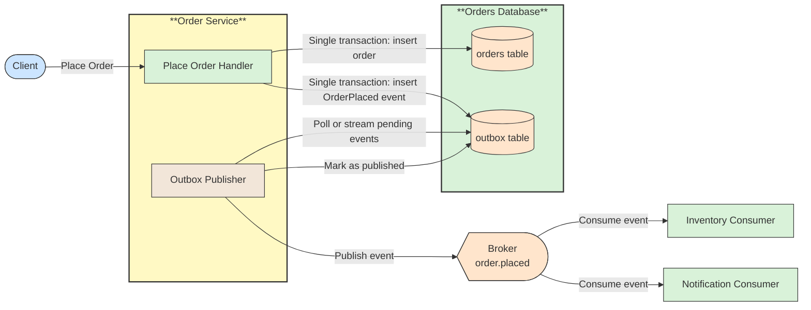

# 🔗 Recipe: Transactional Outbox

## 📖 Problem
A service often has to change its own data and tell other services about it. Writing to the database and publishing to a message broker are two separate operations that cannot normally share one transaction. If the service commits the data and then crashes before publishing, the event is lost. If it publishes first and the commit fails, consumers receive an event for a change that never happened.

The **Transactional Outbox** pattern solves this by writing the event to an **outbox table** in the same local database transaction as the business change. A separate publisher later reads the outbox and sends the events to the broker.

- Makes the data change and the intent to publish succeed or fail together.
- Avoids losing events when the service or broker is temporarily unavailable.
- Removes the need for a distributed transaction between the database and the broker.

---

## 🛍️ Case Study: Order Placement
An order service stores a new order and must notify Inventory and Notifications that it was placed.

- **Order Service** → Saves the order and an `OrderPlaced` outbox row in one transaction.
- **Orders Database** → Holds both the `orders` table and the `outbox` table.
- **Outbox Publisher** → Polls the outbox (or reads the database log) and publishes pending events to the broker.
- **Message Broker** → Delivers the events to subscribers.
- **Inventory / Notification Consumers** → Process the event, tolerating duplicates.

---

## 🛍️ Application Context
The outbox turns "update the database and publish an event" into a single local transaction plus an asynchronous relay. The business request completes as soon as the transaction commits; publication happens shortly afterwards and is retried until it succeeds.

For example, when an order is placed the service inserts a row into `orders` and a row into `outbox` containing the event type, a unique event ID, the payload, and a timestamp. The publisher picks up unpublished rows, sends them to the broker, and then marks them as published or removes them.

Delivery is **at-least-once**. If the publisher sends an event and crashes before marking it as published, it will send it again after restart. Consumers must therefore be idempotent, for example by recording processed event IDs. Events for the same entity should be published in the order they were written when consumers depend on ordering.

There are two common ways to relay the outbox:

- **Polling publisher** → A background worker queries unpublished rows on an interval. It is simple and works with any database, at the cost of some latency and query load.
- **Change data capture (CDC)** → A tool reads the database transaction log and streams new outbox rows to the broker. It lowers latency and polling load but adds infrastructure to operate.

Messages that repeatedly fail at the consumer can be handled with a [Dead Letter Queue](../dead-letter-queue/README.md), and the pattern is a common building block for reliable steps in a [Saga](../../architectural-patterns/saga-pattern/README.md).

---

## ⚙️ General Practices
- **Write the outbox row in the same transaction** → Use the same database transaction as the business change; otherwise the guarantee is lost.
- **Give every event a unique ID** → Consumers use it to detect and ignore duplicates.
- **Design consumers to be idempotent** → The relay delivers at least once, so repeated events must not repeat side effects.
- **Preserve ordering where it matters** → Publish events for the same aggregate in the order they were written, for example by using the aggregate ID as the message key.
- **Clean up published rows** → Delete or archive processed rows on a schedule so the table does not grow without bound.
- **Monitor the backlog** → Alert on the number and age of unpublished rows to detect a stuck publisher or unavailable broker.
- **Run the publisher safely at scale** → When several instances poll the same table, claim rows so two instances do not publish the same event concurrently.
- **Keep payloads stable and minimal** → The stored event is a contract with consumers; version it and avoid leaking internal data.

---

## 📊 Diagram
The service commits the business change and the outbox row together. A separate publisher relays pending events to the broker, and consumers handle them idempotently.

