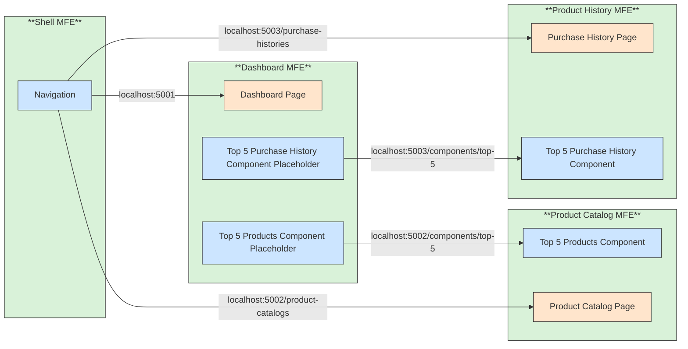

# 🔗 Recipe: Classic Client Side Integration
## 📖 Problem
How can we compose micro‑frontends at the **client side** using:
- **Links** for navigation between full MFEs  
- **iFrames** for embedding isolated MFEs or component routes  
- **JavaScript Transclusion via Web Components** for mounting components directly into another MFE  

---

## 🛍️ Case Study: E‑Commerce Application
We apply this recipe to our e‑commerce case study:

- **AppShell MFE** → provides navigation links to Dashboard, Product Catalog and Purchase History pages  
- **Dashboard MFE** → contains a dashboard page that embeds components from other MFEs  
  - **Top 5 Products Component** loaded from Product Catalog MFE  
  - **Top 5 Purchases Component** loaded from Purchase History MFE  
- **Product Catalog MFE** → provides both a full catalog page and a reusable “Top 5 Products” component  
- **Purchase History MFE** → provides both a full history page and a reusable “Top 5 Purchases” component  

---

## ⚙️ Functionalities
- **Navigation (Links)** → AppShell routes to Dashboard, Product Catalog and Purchase History pages  
- **iFrames** → In AppShell we use iFrames to load the Dashboard, Product Catalog and Purchase History  
- **JavaScript  via Web Compoennts** → Dashboard mounts exposed components directly into its page from Product Catalog and Purchase History
---

## 🛍️ Application Context
The case study models a simplified **e‑commerce application** composed of multiple MFEs:

- **AppShell MFE** → provides navigation and global layout  
- **Dashboard MFE** → aggregates components from other MFEs into a single page view  
- **Product Catalog MFE** → manages product listings and exposes a “Top 5 Products” component  
- **Purchase History MFE** → manages user purchase history and exposes a “Top 5 Purchases” component  

---

## 🔗 Diagram

---

## 🛠️ Technologies Used
This recipe is implemented using:
- **HTML** →   for structural markup for each microfrontend (pages, containers, component placeholders).
- **JavaScript** → for dynamic transclusion and component mounting  
- **CSS** → for styling and consistent UI across MFEs  

---

## ▶️ How to Use
To run the example locally you will need to have node.js install and execute the following commands:

1. **Clone the repository**
   ```bash
   git clone https://github.com/aleczandru1989/architectural-recipes.git.git

2. **Navigate to recipe**
   ```bash
   cd architectural-recipes/microfrontend-composition/client-side-integration-classic/app

3. **Install Packages**
   ```bash
   npm install

4. **Start all MFEs**
   ```bash
   npm run start

5. **Access the application**
   - AppShell - http://localhost:5000
   - Dashboard - http://localhost:5001
   - Product Catalog - http://localhost:5002
   - Purchase History - http://localhost:5003