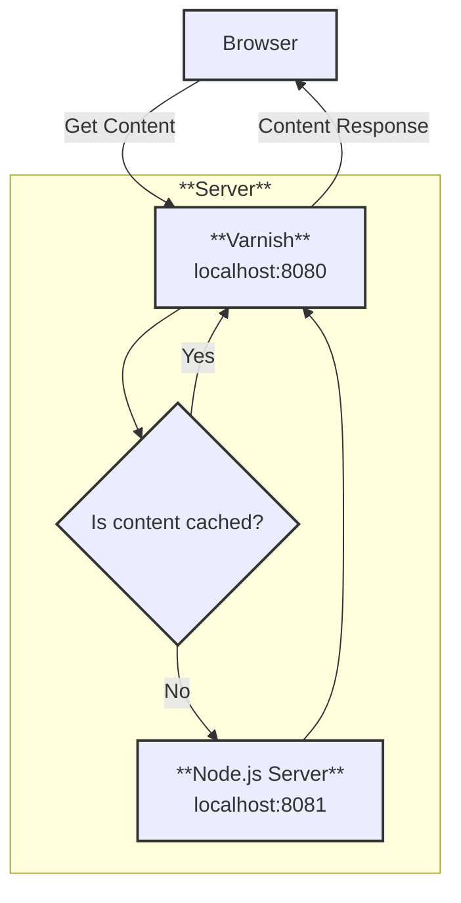

# 🔗 Recipe: Server Side Integration via Varnish and ESI

## 📖 Problem
Modern web applications often need to integrate reusable components (like headers, navigation bars, and footers) across multiple pages. Doing this efficiently while maintaining performance and scalability can be challenging.

This recipe demonstrates how to use **Edge Side Includes (ESI)** with **Varnish** to dynamically assemble a homepage by loading shared components (header, navbar, footer) from separate services, while keeping caching and delivery optimized.

---

## ⚙️ Functionalities
- 🧩 **Componentized Layout**: Homepage assembled from reusable fragments (header, navbar, footer).
- ⚡ **High Performance**: Varnish caches static and dynamic fragments for faster delivery.
- 🔄 **Dynamic Integration**: ESI tags allow server-side composition at the edge.
- 🐳 **Containerized Setup**: Docker Compose ensures reproducible environment and easy deployment.

---

## 📊Diagram

---

## 🛠️ Technologies Used

- **Varnish** 🌀  
  A high-performance HTTP accelerator that caches and serves content quickly. In this recipe, Varnish interprets ESI tags and assembles the homepage from multiple fragments.

- **Express.js** 🚀  
  A lightweight Node.js framework used to serve the application backend and provide endpoints for header, navbar, footer, and main content.

- **ESI (Edge Side Includes)** 🔗  
  A markup language that allows dynamic assembly of web pages at the caching layer. ESI tags tell Varnish which fragments to fetch and include.

- **Docker** 🐳  
  Provides containerization and reproducibility. Docker Compose orchestrates the setup of Varnish and the Express app, ensuring consistent environments across machines.

---

## 🛠️ Technologies Used

- **Varnish** 🌀  
  A high-performance HTTP accelerator that caches and serves content quickly. In this recipe, Varnish interprets ESI tags and assembles the homepage from multiple fragments.

- **Express.js** 🚀  
  A lightweight Node.js framework used to serve the application backend and provide endpoints for header, navbar, footer, and main content.

- **ESI (Edge Side Includes)** 🔗  
  A markup language that allows dynamic assembly of web pages at the caching layer. ESI tags tell Varnish which fragments to fetch and include.

- **Docker** 🐳  
  Provides containerization and reproducibility. Docker Compose orchestrates the setup of Varnish and the Express app, ensuring consistent environments across machines.

---

## ▶️ How to Use

Follow these steps to run the recipe locally:

1. **Clone the repository**
   ```bash
   git clone https://github.com/aleczandru1989/architectural-recipes.git.git


2. **Navigate to recipe**
   ```bash
   cd architectural-recipes/microfrontend-composition/server-side-integration-esi


3. **Run Docker Compose** 
   ```bash
   docker compose up -d

4. **Navigate to recipe app**
   ```bash
   cd app

5. **Install Packages**
   ```bash
   npm install

6. **Run Express App**
    ```bash
    node server.js

7. **Run Browser**
    ```bash
    http://localhost:8000


