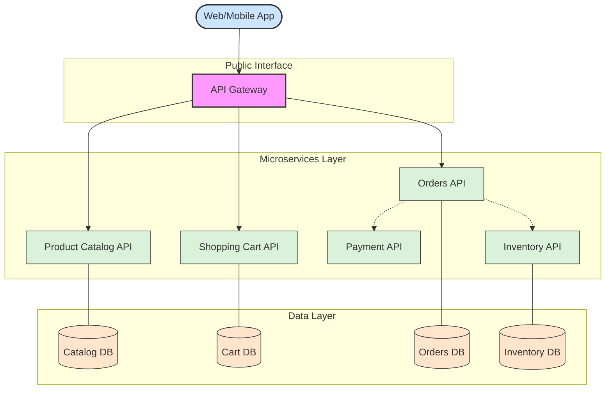

# 🔗 Recipe: Microservices Architectural Pattern

## 📖 Problem
As applications grow in complexity, a **monolithic architecture** becomes difficult to scale, maintain, and deploy. Changes to a single component require rebuilding and redeploying the entire system, leading to long release cycles and high risk. 

The **Microservices pattern** addresses this by decomposing the application into a suite of small, independent services. Each service:
- Runs in its own process.
- Communicates via lightweight protocols (HTTP/REST or gRPC).
- Is built around specific business capabilities.
- Manages its own data and state independently.

---

## 🛍️ Case Study: E‑Commerce Ecosystem
In this architectural model, we break down a traditional retail platform into specialized domain services:

- **API Gateway** → Acts as the entry point for all clients, handling request routing, authentication, and protocol translation.
- **Product Catalog API** → Manages product information, categories, and attributes.
- **Shopping Cart API** → Handles user-specific temporary state and item persistence before purchase.
- **Orders API** → Orchestrates the lifecycle of a purchase, from submission to fulfillment.
- **Payment API** → Manages financial transactions and integrates with external payment gateways.
- **Inventory API** → Monitors stock levels and manages warehouse availability in real-time.

---

## 🛍️ Application Context
The microservices pattern allows each business unit to evolve at its own pace. For example, the **Product Catalog** might use a high-performance Read-Cache for fast browsing, while the **Payment API** prioritizes strict ACID compliance for financial integrity. This "Polyglot" approach ensures that the technology stack is optimized for the specific task of the service rather than being constrained by a global monolith.

---

## ⚙️ General Practices
A well-defined microservices architecture should implement the following core practices to ensure stability and maintainability:

- **Service Discovery** → Enables services to find and communicate with each other dynamically without hardcoding network locations (IP addresses/ports).
- **Externalized Configuration** → Maintains configuration (like credentials or API keys) outside the application code, allowing updates without rebuilding the service.
- **Centralized Logging & Observability** → Aggregates logs and metrics from all services into a single dashboard (e.g., ELK Stack or Prometheus) for rapid debugging.
- **Circuit Breaking** → Prevents a failure in one service (like Payment) from cascading and crashing other services (like Orders) by failing fast when a dependency is down.
- **Distributed Tracing** → Tracks a single request as it travels across multiple services, essential for identifying latency bottlenecks.

---

## 📊 Diagram

