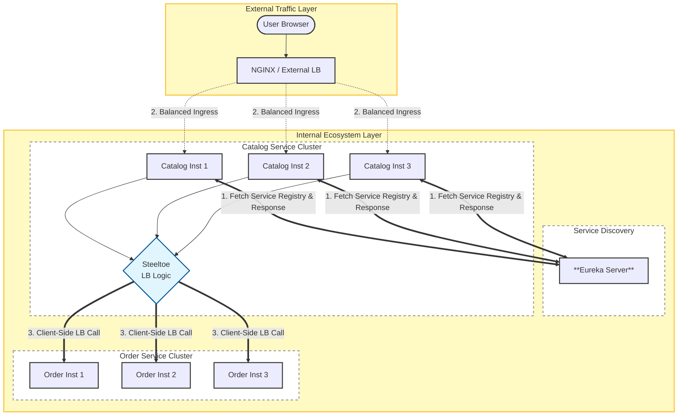

# 🔗 Recipe: Service Discovery and Client-Side Load Balancing via Netflix Eureka

## 📖 Problem
In a microservices architecture, services are often dynamic; they scale up and down, and their IP addresses change frequently (especially in containerized environments like Docker or AWS). Hardcoding these addresses makes the system brittle and impossible to scale.

This recipe demonstrates how to use **Netflix Eureka** as a Service Registry to allow microservices to find each other by name rather than IP, and how to implement **Client-Side Load Balancing** in **ASP.NET Core** (using Steeltoe) to ensure high availability and resilience without the need for an internal hardware load balancer.

---

## ⚙️ Functionalities
- 📂 **Dynamic Service Registry**: Services automatically register and de-register themselves with Eureka.
- 🗺️ **Service Discovery**: Microservices look up "phonebook" entries to find other services by name (e.g., `ORDER-SERVICE`).
- ⚖️ **Client-Side Load Balancing**: The calling application (ASP.NET) chooses which instance to call, reducing network hops and latency.
- 💓 **Health Monitoring**: Eureka tracks service health via heartbeats, ensuring traffic is only sent to "Healthy" instances.
- 🛡️ **Self-Preservation**: Eureka protects the registry during network glitches to prevent catastrophic service eviction.

---

## 📊 Diagram



## 🛠️ Technologies Used

**🛰️ Netflix Eureka Server**  
- Serves as the central service registry for all microservices.

**🌉 ASP.NET Core & Steeltoe**  
- Allows .NET services to register as Eureka clients.  
- Provides internal load balancing and service discovery.

**🌀 NGINX**  
- Functions as the external, high‑level load balancer.  
- Distributes incoming traffic across the API Gateway cluster.

**🐳 Docker Compose**  
- Orchestrates the entire multi‑container microservices environment.

## ▶️ How to Use

Follow these steps to run the recipe locally:

1. **Clone the repository**
   ```bash
   git clone https://github.com/aleczandru1989/architectural-recipes.git.git


2. **Navigate to recipe**
   ```bash
   cd microservices/service-discovery/Eureka


3. **Run Docker Compose** 
   ```bash
   docker compose up -d --build

5. **Run Browser**
    ```bash
    curl http://localhost:8081/product/order
