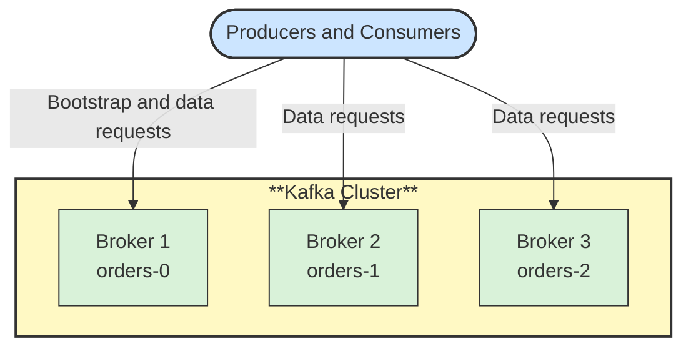

# 🖥️ Broker and Cluster

## 📖 Concept
A **broker** is a Kafka server that stores partitions and serves producers and consumers. A **cluster** is a group of brokers working together, so storage and traffic are spread across machines and data survives the loss of one.

Clients connect to any broker to discover the cluster, then talk directly to the broker that leads each partition they use.

## 🛍️ Example
The retailer runs three brokers. The partitions of `orders.placed` are spread across them, so no single machine holds or serves all order traffic.

## 📊 Diagram
Partitions are distributed across brokers, and clients connect to the brokers that lead them.

**Next** → [Topic](./02-topic.md)
