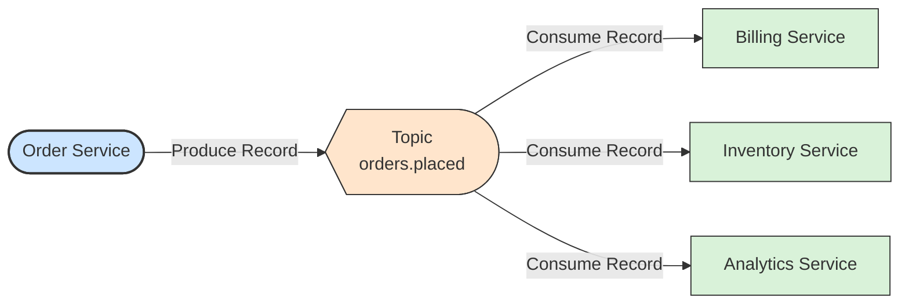

# 🗂️ Topic

## 📖 Concept
A **topic** is a named stream of records, such as `orders.placed`. Producers append records to it and any number of consumers read from it. Unlike a queue, reading does not remove records; they stay until retention removes them, so several consumers can read the same data independently and can replay it.

A topic is a logical name. Physically it is divided into partitions.

## 🛍️ Example
Order Service writes to `orders.placed`. Billing, Inventory, and Analytics each read the same topic without affecting each other.

## 📊 Diagram
One topic can serve many independent consumers.

**Previous** → [Broker and Cluster](./01-broker-and-cluster.md)  
**Next** → [Partition](./03-partition.md)
