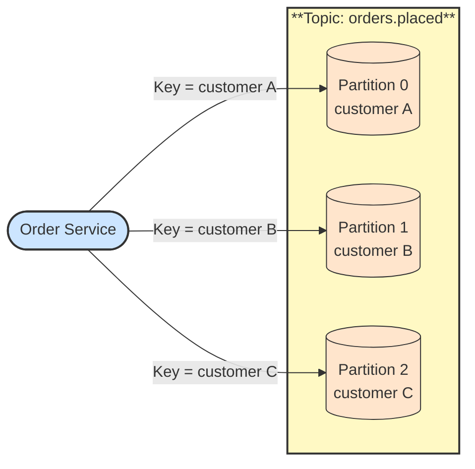

# 🧩 Partition

## 📖 Concept
A topic is split into one or more **partitions**. Each partition is an ordered, append-only log stored on a broker. Kafka guarantees order **within a partition**, not across the whole topic.

Partitions are the unit of parallelism: each partition is read by at most one consumer in a group, so the partition count limits how many consumers in a group can work at once. When a record has a key, the same key always goes to the same partition (while the partition count is unchanged), which keeps related records in order.

## 🛍️ Example
`orders.placed` has three partitions and uses the customer ID as the key. All orders from one customer land in the same partition and stay in order, while different customers are processed in parallel.

## 📊 Diagram
Records with the same key always go to the same partition.

**Previous** → [Topic](./02-topic.md)  
**Next** → [Record](./04-record.md)
