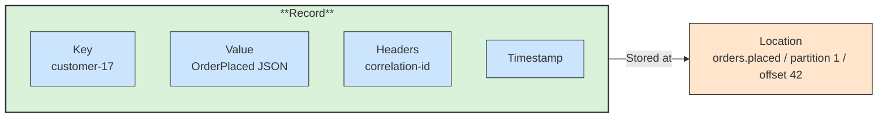

# 📨 Record

## 📖 Concept
A **record** (message) is one entry in a partition. It contains:

- **Key** → Optional; used to choose the partition and to identify the entity (and for compaction).
- **Value** → The payload, usually JSON, Avro, or Protobuf.
- **Headers** → Optional metadata such as a correlation ID or schema version.
- **Timestamp** → Creation or append time.
- **Offset** → A sequential number assigned by the partition, unique within that partition.

Records are immutable once written. A record is located by topic, partition, and offset.

## 🛍️ Example
An `OrderPlaced` record uses the customer ID as the key, an order JSON as the value, and a `correlation-id` header, and gets offset `42` in partition 1.

## 📊 Diagram
A record has its own parts and is addressed by topic, partition, and offset.

**Previous** → [Partition](./03-partition.md)  
**Next** → [Producer](./05-producer.md)
