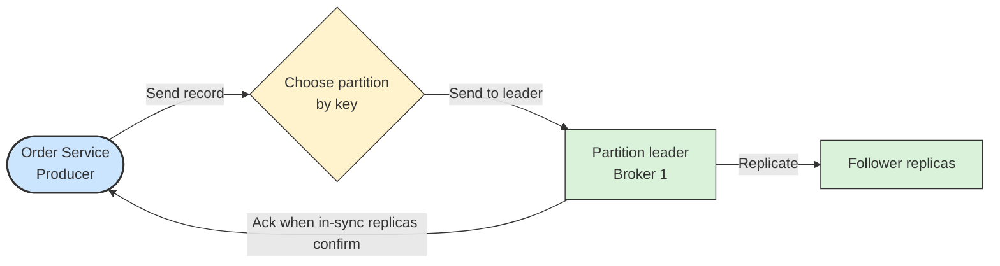

# ✉️ Producer

## 📖 Concept
A **producer** publishes records to a topic. For each record it chooses a partition: by hashing the key, or, if there is no key, by spreading records across partitions.

Important producer settings:

- **`acks`** → How many brokers must confirm a write: `0` (none), `1` (leader only), or `all` (all in-sync replicas). `all` is the safest.
- **Retries and idempotence** → With `enable.idempotence=true`, retries do not create duplicate records in a partition.
- **Batching** → `linger.ms` and `batch.size` group records for throughput at the cost of a little latency.
- **Compression** → Reduces network and storage use.

## 🛍️ Example
Order Service sends `OrderPlaced` with `acks=all` and idempotence enabled, so a network retry does not duplicate an order event.

## 📊 Diagram
The producer picks a partition, sends the record to its leader, and waits for acknowledgment.

**Previous** → [Record](./04-record.md)  
**Next** → [Consumer and Consumer Group](./06-consumer-and-consumer-group.md)
