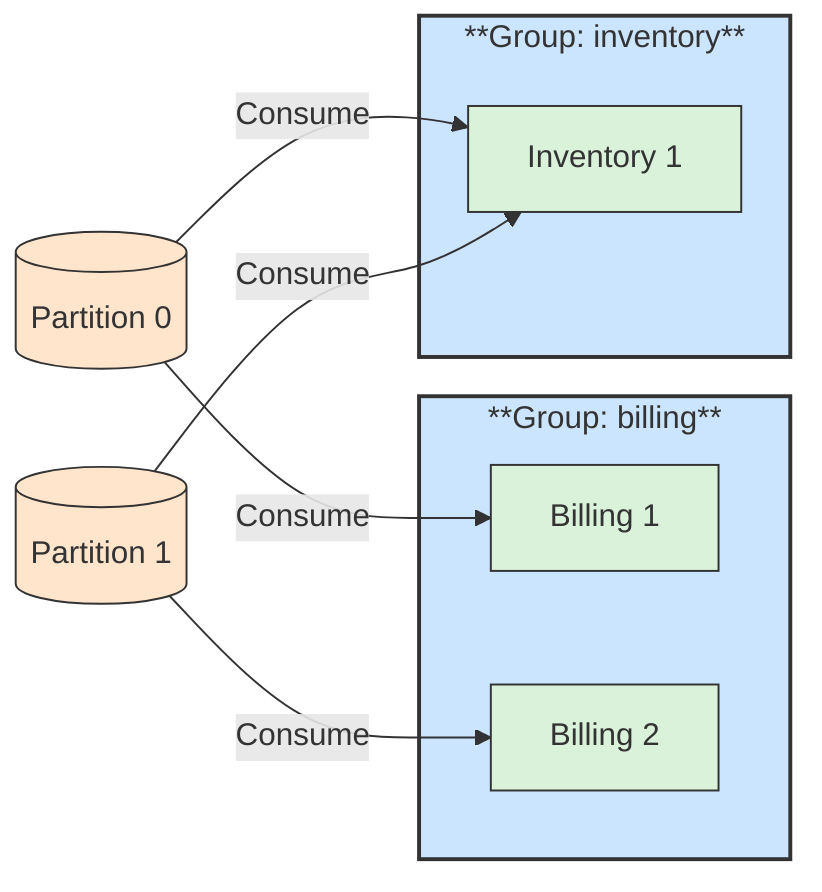

# 📥 Consumer and Consumer Group

## 📖 Concept
A **consumer** reads records from topic partitions, pulling them at its own pace. Consumers that share a `group.id` form a **consumer group**: Kafka assigns each partition to exactly one consumer in the group, so the group splits the work.

- Different groups each receive all records of a topic (publish/subscribe).
- Within one group, each record is processed by one consumer (competing consumers).
- If a consumer joins or leaves, Kafka **rebalances** the partitions.
- More consumers than partitions leaves the extra consumers idle.

## 🛍️ Example
Billing runs two instances in the group `billing`, each reading some partitions of `orders.placed`. Inventory uses its own group `inventory` and reads every order too.

## 📊 Diagram
Each group gets every record; inside a group each partition has one consumer.

**Previous** → [Producer](./05-producer.md)  
**Next** → [Offsets and Commits](./07-offsets-and-commits.md)
