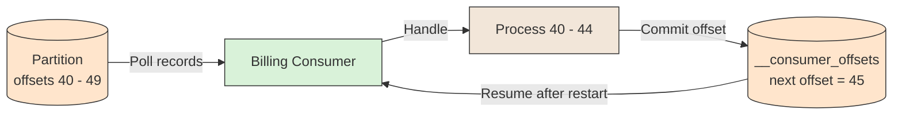

# 🔖 Offsets and Commits

## 📖 Concept
An **offset** is a record's position in a partition. A consumer group tracks its progress by **committing** the offset of the next record it will read, stored in the internal `__consumer_offsets` topic. After a restart or rebalance, the consumer resumes from the last committed offset.

When to commit determines the guarantee:

- **Commit before processing** → A crash may skip records (at-most-once).
- **Commit after processing** → A crash may reprocess records (at-least-once). This is the usual choice, with idempotent processing.
- **Auto-commit** → Convenient, but commits on a timer, which can commit work not yet finished; prefer manual commits for important processing.

Consumer **lag** is the difference between the latest offset and the committed offset; it shows how far behind a group is. A group can also reset its offsets to replay data.

## 🛍️ Example
Billing processes offsets 40 to 44 of a partition and commits offset 45. If it crashes before the commit, it restarts at 40 and may charge an order twice unless it checks for duplicates.

## 📊 Diagram
The consumer processes records, then commits the next offset to resume from after a failure.

**Previous** → [Consumer and Consumer Group](./06-consumer-and-consumer-group.md)  
**Next** → [Replication and ISR](./08-replication-and-isr.md)
