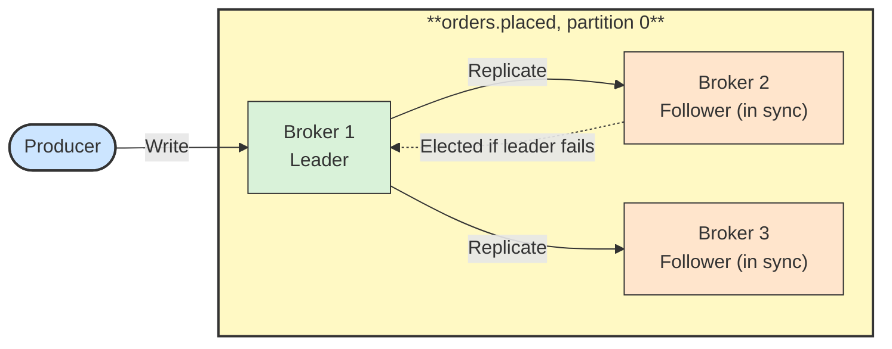

# 🛡️ Replication and ISR

## 📖 Concept
Each partition is copied to several brokers according to the topic's **replication factor**. One copy is the **leader**, which handles all reads and writes; the others are **followers** that replicate from it.

The **in-sync replicas (ISR)** are the replicas caught up with the leader. If the leader fails, a new leader is elected from the ISR, so no acknowledged data is lost.

Settings that work together:

- **`replication.factor`** → Number of copies; 3 is common in production.
- **`acks=all`** → The producer waits for all in-sync replicas.
- **`min.insync.replicas`** → Minimum ISR size needed to accept writes; with factor 3, a value of 2 tolerates one broker failure without losing acknowledged data.
- **Unclean leader election** → Keep disabled so an out-of-sync replica cannot become leader and drop data.

## 🛍️ Example
`orders.placed` uses replication factor 3 and `min.insync.replicas=2`. If one broker fails, writes continue; if two fail, producers using `acks=all` get errors rather than risking data loss.

## 📊 Diagram
The leader serves clients while followers replicate, and a follower takes over if the leader fails.

**Previous** → [Offsets and Commits](./07-offsets-and-commits.md)  
**Next** → [Delivery Semantics](./09-delivery-semantics.md)
