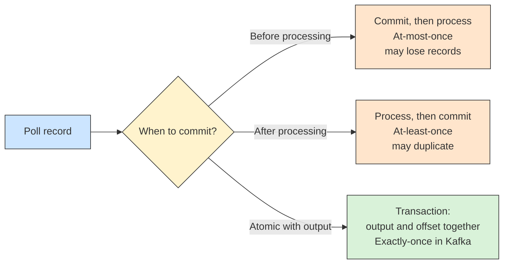

# 🎯 Delivery Semantics

## 📖 Concept
Delivery semantics describe how many times a record is processed after failures:

- **At-most-once** → A record is processed zero or one time; failures can lose records. Offsets are committed before processing.
- **At-least-once** → A record is processed one or more times; failures can cause duplicates. Offsets are committed after processing. This is the common default.
- **Exactly-once** → The effect of processing happens once. Kafka supports this inside Kafka with idempotent producers and **transactions**: a consume-process-produce step writes its output records and its consumed offsets atomically, and consumers read with `isolation.level=read_committed`.

Exactly-once applies to data flowing through Kafka. Side effects in external systems, such as a database or payment provider, still need **idempotent** handling, for example a unique key or deduplication table.

## 🛍️ Example
Billing is at-least-once, so it stores the order ID with a unique constraint and skips orders already charged. A stream that turns orders into invoice events uses a Kafka transaction so each order creates exactly one invoice record.

## 📊 Diagram
Where the offset is committed relative to processing decides the guarantee.

**Previous** → [Replication and ISR](./08-replication-and-isr.md)  
**Next** → [Retention and Log Compaction](./10-retention-and-log-compaction.md)
