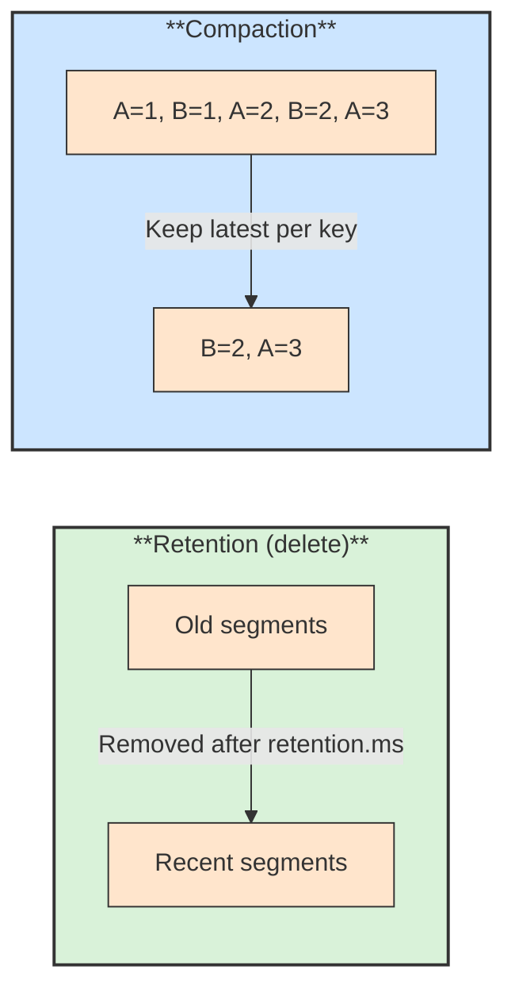

# 🗑️ Retention and Log Compaction

## 📖 Concept
Kafka keeps records independently of whether they were consumed. Two policies decide what is removed:

- **Time or size retention (`cleanup.policy=delete`)** → Old log segments are deleted after `retention.ms` (default seven days) or when the partition exceeds `retention.bytes`.
- **Log compaction (`cleanup.policy=compact`)** → Kafka keeps at least the latest record for each key and removes older ones, so the topic holds the latest state per key. A record with a key and a null value (a **tombstone**) marks that key for deletion.

Both can be combined with `compact,delete`. A consumer that falls behind retention loses the records it did not read, so retention should exceed the longest expected outage or replay need.

## 🛍️ Example
`orders.placed` is kept for 14 days so services can recover and replay. A `customers.profile` topic is compacted by customer ID, so a new service can rebuild the latest profile of every customer by reading it from the start.

## 📊 Diagram
Retention deletes old segments; compaction keeps the latest value for each key.

**Previous** → [Delivery Semantics](./09-delivery-semantics.md)  
**Next** → [KRaft Controller](./11-kraft-controller.md)
