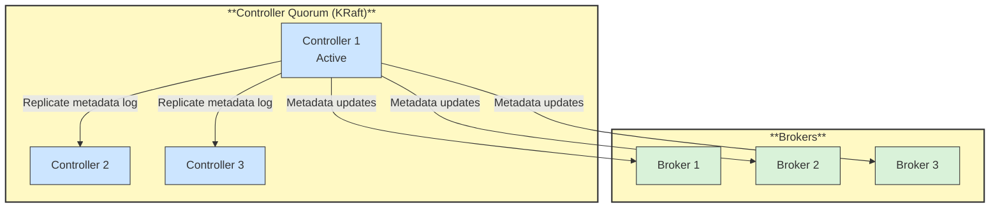

# 🧭 KRaft Controller

## 📖 Concept
Kafka needs a place to keep cluster metadata: which topics exist, where partition leaders are, and which brokers are alive. Older versions stored this in Apache ZooKeeper. Current Kafka uses **KRaft** (Kafka Raft), where a quorum of **controller** nodes keeps the metadata in an internal replicated log using the Raft consensus protocol. ZooKeeper is removed in Kafka 4.0.

- One controller is the active leader and handles changes such as electing partition leaders.
- Controllers can run on dedicated nodes or on the same nodes as brokers (combined mode, usually for small or development setups).
- Production clusters typically use three controllers, so the quorum survives one failure.

## 🛍️ Example
The retailer runs three dedicated controllers and several brokers. When a broker fails, the active controller elects new leaders for its partitions from the in-sync replicas.

## 📊 Diagram
Controllers keep the metadata and brokers follow it.

**Previous** → [Retention and Log Compaction](./10-retention-and-log-compaction.md)  
**Next** → [Kafka Connect and Kafka Streams](./12-kafka-connect-and-streams.md)
