# 🔌 Kafka Connect and Kafka Streams

## 📖 Concept
Two tools extend Kafka beyond plain producers and consumers:

- **Kafka Connect** → A framework to move data between Kafka and other systems using ready-made **source connectors** (database to Kafka) and **sink connectors** (Kafka to a database, search index, or storage). It handles scaling, offsets, and retries without custom code. Connectors can also apply simple transformations.
- **Kafka Streams** → A Java library for processing topics inside your application: filtering, transforming, joining, and aggregating records, with local state and fault tolerance. **ksqlDB** offers similar processing through SQL.

Use Connect for integration with external systems and Streams (or ksqlDB) for stream processing. Streams is how patterns such as filtering and aggregation are done on Kafka; see [Filtering and Routing](../../../asynchronous-communication/filtering-and-routing/Kafka/README.md) and [Aggregation and Batch Processing](../../../asynchronous-communication/aggregation-and-batch-processing/Kafka/README.md).

## 🛍️ Example
A source connector copies new rows from the orders database into `orders.placed`. A Kafka Streams application aggregates them into sales per product, and a sink connector writes the result to a reporting database.

## 📊 Diagram
Connect moves data in and out, and Streams processes data between topics.

```mermaid
flowchart LR
    Source[("Orders DB")]
    SourceConn["Source Connector"]
    In@{ shape: curv-trap, label: "Topic<br/>orders.placed" }
    Streams["Kafka Streams<br/>aggregate sales"]
    Out@{ shape: curv-trap, label: "Topic<br/>sales.per-product" }
    SinkConn["Sink Connector"]
    Sink[("Reporting DB")]

    Source -- Read changes --> SourceConn
    SourceConn -- Produce --> In
    In -- Consume --> Streams
    Streams -- Produce --> Out
    Out -- Consume --> SinkConn
    SinkConn -- Write --> Sink

    classDef store fill:#ffe5cc,stroke:#333,stroke-width:1px;
    classDef processor fill:#f2e6d9,stroke:#333,stroke-width:1px;
    classDef component fill:#cce5ff,stroke:#333,stroke-width:1px;
    class Source,Sink,In,Out store;
    class Streams processor;
    class SourceConn,SinkConn component;
```

**Previous** → [KRaft Controller](./11-kraft-controller.md)
