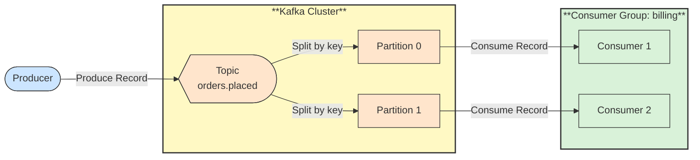

# 🔗 Recipe: Kafka Fundamentals

## 📖 Problem
Teams adopting Apache Kafka often use it as a plain message queue and then run into surprises: messages arriving out of order, consumers reprocessing data, partitions that cannot scale, or data that disappears after a retention period. Most of these issues come from not understanding a few core concepts.

**Apache Kafka** is a distributed, durable log of records. Producers append records to topics, and consumers read them at their own pace. Understanding the main building blocks makes it easier to design systems that are ordered where needed, scalable, and recoverable.

- Explains the main Kafka concepts one at a time, in a learning order.
- Shows how each concept affects ordering, scaling, and reliability.
- Prepares for the runnable Kafka recipes in this repository.

---

## 🛍️ Case Study: E-Commerce Orders
An online retailer publishes an event whenever an order is placed. Several services react to it independently: billing charges the customer, inventory reserves stock, and analytics records the sale.

- **Order Service** → Produces `orders.placed` events.
- **Billing Service** → Consumes orders to charge customers.
- **Inventory Service** → Consumes orders to reserve stock.
- **Analytics Service** → Consumes the same orders to build reports.

---

## 🛍️ Application Context
Kafka fits when many services need the same stream of events, when events must be kept and replayed, or when throughput is high. It is less suitable for simple request/reply interactions or for very small workloads where a plain queue is enough.

The concepts below are organized as a learning path, from the cluster that stores data, to how data is written and read, to the guarantees Kafka gives and the tools around it.

---

## 🧭 Learning Path
Read the concepts in order. Each page introduces one idea, gives an order-processing example, and includes a diagram.

### Storage and Structure
1. [Broker and Cluster](./01-broker-and-cluster.md) → The servers that store and serve data.
2. [Topic](./02-topic.md) → A named stream of records.
3. [Partition](./03-partition.md) → The unit of ordering, storage, and parallelism.
4. [Record](./04-record.md) → The key, value, headers, and offset of one message.

### Writing and Reading
5. [Producer](./05-producer.md) → Publish records and choose their partition and durability.
6. [Consumer and Consumer Group](./06-consumer-and-consumer-group.md) → Read records and share work across instances.
7. [Offsets and Commits](./07-offsets-and-commits.md) → Track reading progress and recover from failures.

### Reliability and Guarantees
8. [Replication and ISR](./08-replication-and-isr.md) → Keep copies of partitions to survive broker failures.
9. [Delivery Semantics](./09-delivery-semantics.md) → At-most-once, at-least-once, and exactly-once behavior.
10. [Retention and Log Compaction](./10-retention-and-log-compaction.md) → Decide how long records stay and which are kept.

### Platform
11. [KRaft Controller](./11-kraft-controller.md) → How the cluster manages its own metadata.
12. [Kafka Connect and Kafka Streams](./12-kafka-connect-and-streams.md) → Move data in and out, and process streams.

---

## ⚙️ General Practices
- **Choose keys deliberately** → Records with the same key go to the same partition, so the key defines ordering and load distribution.
- **Plan partition counts early** → Partitions limit consumer parallelism and are hard to reduce; increasing them changes key-to-partition mapping.
- **Use consumer groups for scaling** → Add instances in a group to share partitions, up to the partition count.
- **Make consumers idempotent** → Redelivery can happen, so processing the same record twice must be safe.
- **Commit offsets after processing** → Commit only when the work is done, to avoid losing records on failure.
- **Set replication and acknowledgments for durability** → Use replication factor 3, `min.insync.replicas=2`, and `acks=all` for important data.
- **Define retention to match the use case** → Keep data long enough for replay and recovery, and use compaction for latest-state topics.
- **Version event schemas** → Use a schema format and registry so producers and consumers can evolve independently.
- **Monitor lag** → Track consumer lag per group and partition to see when consumers fall behind.
- **Use dead letter topics for poison records** → Route records that repeatedly fail to a separate topic; see [Dead Letter Queue](../../../asynchronous-communication/dead-letter-queue/README.md).

---

## 📊 Diagram
The learning path starts with the cluster structure, then moves to data flow and the guarantees that make it reliable.

