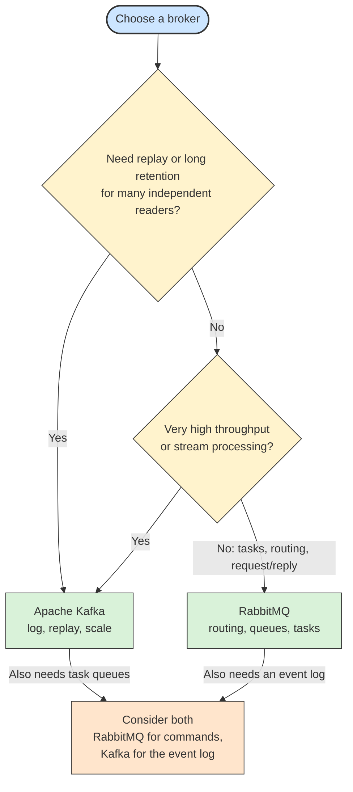

# ⚖️ Recipe: Kafka vs RabbitMQ

## 📖 Problem
Kafka and RabbitMQ are both described as message brokers, so they are often treated as interchangeable. They are built on different models: Kafka is a distributed, replayable **log** that consumers read from, while RabbitMQ is a **router** that pushes messages into queues and removes them once they are acknowledged. Choosing the wrong one leads to workarounds, such as emulating replay on a queue or emulating complex routing on a log.

This recipe lines up the concepts that occupy the same space in both brokers, then shows which one fits which use case.

- Maps each Kafka concept to its closest RabbitMQ counterpart.
- Highlights where the mapping breaks down.
- Gives use-case guidance and a simple decision flow.

For the details of each broker, see [Kafka Fundamentals](../kafka-fundamentals/README.md) and [RabbitMQ Fundamentals](../rabbitmq-fundamentals/README.md).

---

## 🛍️ Case Study: E-Commerce Orders
The retailer publishes an event when an order is placed. Billing must charge each order once, Inventory reserves stock, Notifications emails the customer, and a new Analytics service wants to rebuild its data from all past orders.

- **Work distribution** → Billing instances share the orders and each order is charged once.
- **Selective delivery** → Notifications only wants some event types.
- **Replay** → Analytics needs the full history, including events from before it existed.
- **Throughput** → Click and page-view events arrive in huge volumes.

---

## 🛍️ Application Context
The concepts below fill similar roles in both brokers, but are not identical. Read the "Key difference" column before assuming they are equivalent.

### Concept Mapping

| Role | Kafka | RabbitMQ | Key difference |
|------|-------|----------|----------------|
| Core model | Distributed append-only log | Message router with queues | Kafka stores events and readers track position; RabbitMQ delivers messages and removes them once acknowledged |
| Entry point for producers | Topic | Exchange | Kafka producers write straight to a topic; RabbitMQ producers publish to an exchange that decides the queues |
| Place messages wait | Partition of a topic | Queue | A queue is one ordered buffer; a topic splits into several ordered partitions |
| Routing | Partition chosen by record key; filtering done by consumers or Streams | Exchange types (direct, fanout, topic, headers) and bindings | RabbitMQ routes inside the broker; Kafka has no built-in content routing |
| Publish/subscribe | Each consumer group reads the whole topic | One queue per subscriber bound to a fanout or topic exchange | In Kafka a new reader is just a new group; in RabbitMQ it needs a new queue and binding before messages are published |
| Competing consumers | Consumers in one group share partitions | Consumers share one queue | Kafka parallelism is capped by the partition count; a queue can have any number of consumers |
| Reading progress | Offset committed per group and partition | Acknowledgement per message | Kafka reads can be rewound; an acknowledged RabbitMQ message is gone |
| Delivery to consumers | Consumer pulls batches | Broker pushes to consumers, limited by prefetch | Pull gives the consumer control of pace; push gives lower latency per message |
| Ordering | Guaranteed per partition | Per queue, weakened by multiple consumers and redelivery | Kafka keys keep related records ordered while still scaling out |
| Retention | Time, size, or compaction; independent of reading | Until acknowledged, TTL, or queue limits (streams keep a log) | Kafka can serve the same data again and again |
| Replay | Reset the group offset | Not for classic or quorum queues; supported by streams | Replay is a core Kafka feature |
| Replication | Replication factor and ISR per partition | Quorum queues (Raft) and streams | Both replicate; classic RabbitMQ queues do not |
| Failure handling | No native dead letter; use retry and dead letter topics | Native dead letter exchange, TTL, delivery limit | RabbitMQ has it built in; Kafka needs application or framework support |
| Delivery guarantees | At-least-once; exactly-once within Kafka using transactions | At-least-once with confirms and acks; at-most-once with auto-ack | Exactly-once with external systems needs idempotent consumers in both |
| Priorities and per-message TTL | Not supported | Priority queues and TTL | Use separate topics in Kafka |
| Request/reply | Emulated with reply topics and correlation IDs | Native pattern with reply queues and `correlation_id` | Natural fit in RabbitMQ |
| Stream processing | Kafka Streams, ksqlDB | Consumer code, or RabbitMQ streams with external engines | Kafka has a richer ecosystem |
| Integration tooling | Kafka Connect | Plugins such as Shovel and Federation | Connect has far more ready connectors |
| Cluster metadata | KRaft controllers | Erlang cluster with Raft for quorum queues | Both run as a cluster; Kafka scales partitions across brokers more easily |
| Protocols | Own binary protocol | AMQP 0-9-1, plus AMQP 1.0, MQTT, STOMP | RabbitMQ is more flexible for mixed clients and IoT |

### Which One Fits Which Use Case

| Use case | Better fit | Why |
|----------|------------|-----|
| Task queue and background jobs | RabbitMQ | Each job is processed once and removed, with acknowledgements, retries, and priorities |
| Complex or content-based routing | RabbitMQ | Exchange types and bindings route messages inside the broker |
| Request/reply (RPC-style) | RabbitMQ | Native reply queues and correlation IDs |
| Per-message delay, TTL, or priority | RabbitMQ | Built in |
| Mixed protocols and devices (MQTT, STOMP, AMQP) | RabbitMQ | Protocol plugins and broad client support |
| Event streaming and event sourcing | Kafka | The durable log is the source of truth and can be re-read |
| Replay and onboarding new consumers | Kafka | A new group reads the full retained history |
| Very high throughput and large volumes | Kafka | Sequential I/O, batching, and partition-level scaling |
| Many independent consumers of the same data | Kafka | Each group reads independently without extra queues |
| Stream processing and analytics | Kafka | Kafka Streams, ksqlDB, and Connect |
| Change data capture and data pipelines | Kafka | Connectors move data in and out reliably |
| Strict per-key ordering at scale | Kafka | Key-based partitioning keeps order while scaling out |
| Small system, simple async messaging | RabbitMQ | Lighter to operate and easier to start with |
| Low-latency message delivery with modest volume | RabbitMQ | Push delivery and in-memory handling for small messages |

The two are not mutually exclusive. A common design uses RabbitMQ for commands and task queues and Kafka for the event log and analytics, with a connector or relay between them where needed.

---

## ⚙️ General Practices
- **Decide by data lifetime** → If messages are work to finish and discard, use a queue; if they are facts to keep and re-read, use a log.
- **Check the replay requirement early** → Needing history for new or recovering consumers points strongly to Kafka (or RabbitMQ streams).
- **Match the ordering need** → Define the key that needs ordering, then confirm the broker can scale while preserving it.
- **Plan partitions in Kafka and queue topology in RabbitMQ** → Both are hard to change later; Kafka partitions limit parallelism and RabbitMQ bindings define routing.
- **Make consumers idempotent in both** → Both can deliver a message more than once.
- **Do not copy patterns blindly** → Using Kafka as a work queue or RabbitMQ as an event store works against its design and adds workarounds.
- **Consider operations** → Kafka needs capacity planning for partitions and disks; RabbitMQ needs attention to queue length, memory, and clustering.
- **Combine when each part has a clear role** → Keep responsibilities separate and avoid duplicating the same flow in both brokers.

---

## 📊 Diagram

