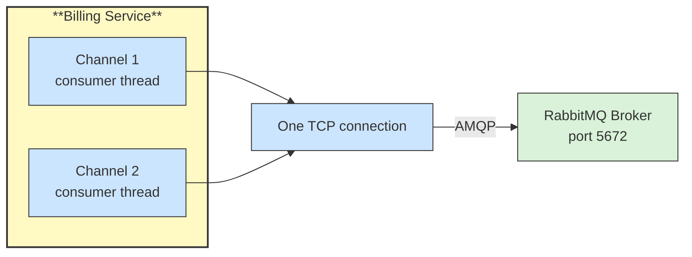

# 🖥️ Broker, Connection and Channel

## 📖 Concept
The **broker** is the RabbitMQ server that receives, routes, and stores messages. Clients connect to it over AMQP (port `5672`, or `5671` with TLS).

- **Connection** → A long-lived TCP connection between an application and the broker. It is relatively expensive, so an application usually opens one or a few.
- **Channel** → A lightweight virtual connection inside a connection. Publishing, consuming, and declaring all happen on a channel. Use a separate channel per thread, since channels are not thread-safe in most clients.

A channel-level error closes only that channel, while a connection-level error closes the connection and every channel in it.

## 🛍️ Example
Order Service opens one connection to the broker and uses one channel to publish events. Billing opens one connection and one channel per consumer thread.

## 📊 Diagram
Many channels share one connection to the broker.

**Next** → [Virtual Host](./02-virtual-host.md)
