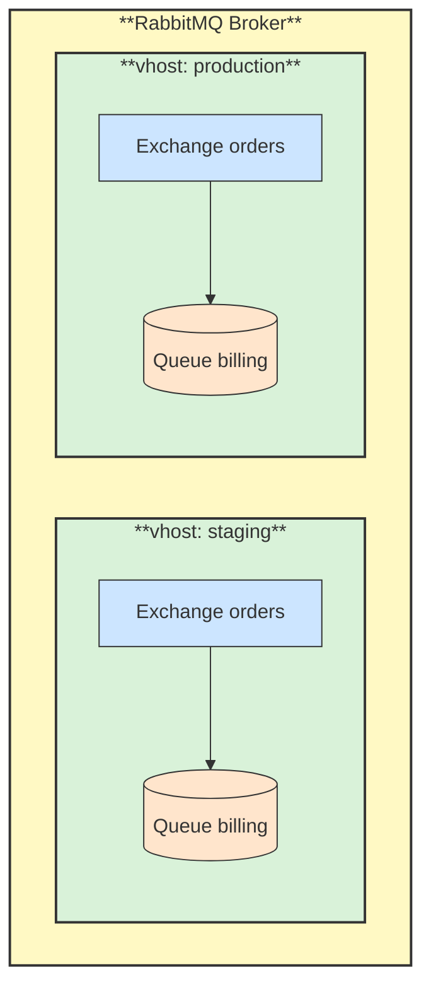

# 🗄️ Virtual Host

## 📖 Concept
A **virtual host** (vhost) is an isolated namespace inside one broker. Exchanges, queues, bindings, users' permissions, and policies belong to a vhost, and nothing is shared between vhosts. A client connects to one vhost, and the default is `/`.

Use vhosts to separate environments, teams, or applications on the same broker, and grant each user access only to the vhosts it needs.

## 🛍️ Example
One broker serves both `staging` and `production` vhosts. A queue named `billing` can exist in both without conflict, and the staging user has no access to production.

## 📊 Diagram
Each vhost has its own exchanges and queues.

**Previous** → [Broker, Connection and Channel](./01-broker-connection-and-channel.md)  
**Next** → [Exchange](./03-exchange.md)
