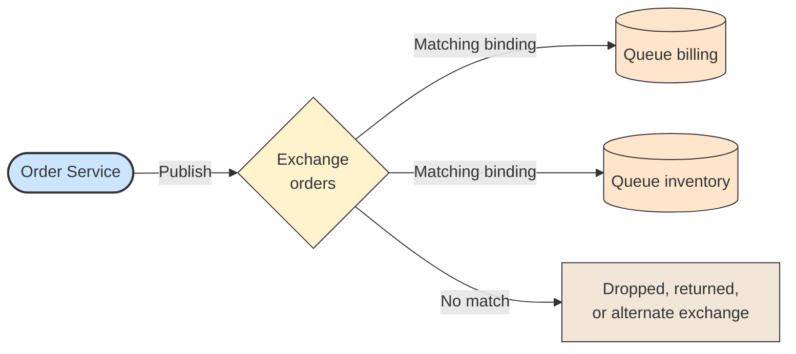

# 🚪 Exchange

## 📖 Concept
An **exchange** is where producers send messages. A producer never publishes directly to a queue; the exchange receives the message and routes it to zero or more queues according to its type and bindings.

If no queue matches, the message is dropped unless the publisher sets the **mandatory** flag, in which case it is returned, or the exchange has an **alternate exchange** that catches unroutable messages.

Exchanges can be durable (they survive a restart) and are declared by name. The empty-name default exchange routes by queue name, which is convenient for simple examples.

## 🛍️ Example
Order Service publishes `order.placed` messages to the `orders` exchange. It does not know which services consume them.

## 📊 Diagram
The producer only knows the exchange; the exchange decides the queues.

**Previous** → [Virtual Host](./02-virtual-host.md)  
**Next** → [Queue](./04-queue.md)
