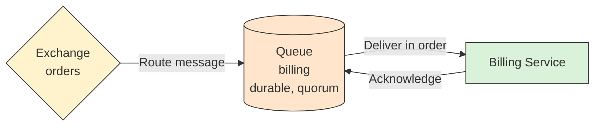

# 📦 Queue

## 📖 Concept
A **queue** buffers messages until a consumer processes them. Messages are delivered in first-in, first-out order and, once acknowledged, are removed. Queue properties include:

- **Durable** → The queue definition survives a broker restart.
- **Exclusive** → Used by one connection and deleted when it closes.
- **Auto-delete** → Deleted when its last consumer unsubscribes.
- **Arguments** → Settings such as message TTL, maximum length, dead letter exchange, and queue type.

Queue types include **classic**, **quorum** (replicated, recommended for important data), and **stream** (an append-only log). When one queue has several consumers, the broker spreads messages among them.

Ordering is guaranteed per queue with a single consumer; with several consumers, or after redelivery, processing order can differ.

## 🛍️ Example
The `billing` queue holds order messages until a Billing instance charges them. If Billing is down for a while, messages wait in the queue.

## 📊 Diagram
The queue stores messages between the exchange and the consumers.

**Previous** → [Exchange](./03-exchange.md)  
**Next** → [Binding and Routing Key](./05-binding-and-routing-key.md)
