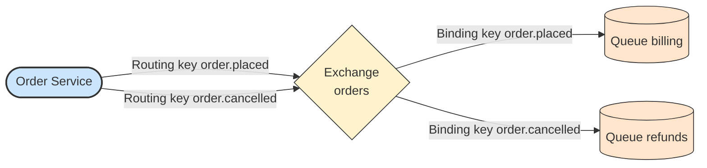

# 🔗 Binding and Routing Key

## 📖 Concept
A **binding** links an exchange to a queue. It may include a **binding key** (or arguments, for a headers exchange) that tells the exchange which messages the queue wants.

A **routing key** is a string the producer attaches to each message. The exchange compares it with the binding keys, using rules that depend on its type (see [Exchange Types](./06-exchange-types.md)), and routes the message to the matching queues.

The same queue can have several bindings, and one exchange can have many queues bound with different keys. Bindings are what make routing flexible without changing the producer.

## 🛍️ Example
The `billing` queue is bound to `orders` with the key `order.placed`. A message published with routing key `order.placed` reaches `billing`, while one with `order.cancelled` does not.

## 📊 Diagram
Bindings decide which queue receives a message with a given routing key.

**Previous** → [Queue](./04-queue.md)  
**Next** → [Exchange Types](./06-exchange-types.md)
