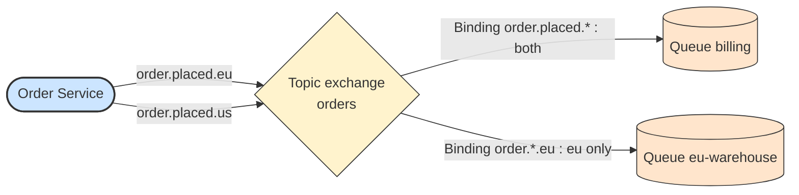

# 🔀 Exchange Types

## 📖 Concept
The exchange type defines how a routing key or message properties are matched against bindings.

- **Direct** → Routes to queues whose binding key equals the routing key exactly. Good for targeted delivery and work queues.
- **Fanout** → Ignores the key and routes to every bound queue. Good for broadcast (publish/subscribe).
- **Topic** → Matches dot-separated keys against patterns: `*` matches one word and `#` matches zero or more words, so `order.*` or `order.#` are possible. Good for selective subscriptions.
- **Headers** → Matches message header values instead of the routing key, with `x-match` of `all` or `any`. Useful when routing depends on several attributes.
- **Default exchange** → A nameless direct exchange that routes to the queue named by the routing key.

These map to the communication patterns in this section: fanout for publish/subscribe, direct or the default exchange for point-to-point, and topic or headers for content-based routing.

## 🛍️ Example
A topic exchange `orders` receives `order.placed.eu` and `order.placed.us`. Billing binds with `order.placed.*` and gets both, while the EU warehouse binds with `order.*.eu` and gets only the European ones.

## 📊 Diagram
A topic exchange matches patterns, so each queue receives only what it asked for.

**Previous** → [Binding and Routing Key](./05-binding-and-routing-key.md)  
**Next** → [Producer and Publisher Confirms](./07-producer-and-publisher-confirms.md)
