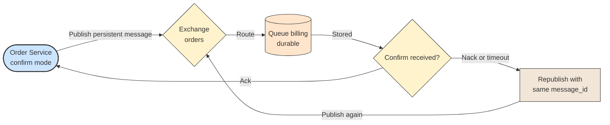

# ✉️ Producer and Publisher Confirms

## 📖 Concept
A **producer** publishes a message with a body, a routing key, and properties such as `delivery_mode` (persistent or transient), `message_id`, `correlation_id`, and headers. By default publishing is fire-and-forget: the client does not learn whether the broker accepted or stored it.

**Publisher confirms** make publishing reliable. The channel is put in confirm mode, and the broker sends an acknowledgement (`ack`) once it has taken responsibility for the message (for persistent messages in durable queues, after writing it to disk or replicating it for quorum queues), or a negative acknowledgement (`nack`) on failure. The producer can retry unconfirmed messages.

Add the **mandatory** flag so unroutable messages are returned instead of silently dropped. Retrying can create duplicates, so consumers must handle them.

## 🛍️ Example
Order Service enables confirms and publishes a persistent `order.placed` message with a `message_id`. If no confirm arrives within a timeout, it republishes the message with the same `message_id`, so consumers can detect a duplicate.

## 📊 Diagram
The broker confirms messages, and the producer retries those left unconfirmed.

**Previous** → [Exchange Types](./06-exchange-types.md)  
**Next** → [Consumer and Acknowledgements](./08-consumer-and-acknowledgements.md)
