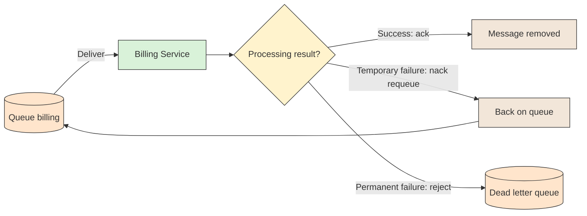

# 📥 Consumer and Acknowledgements

## 📖 Concept
A **consumer** subscribes to a queue, and the broker pushes messages to it. After processing, the consumer tells the broker the outcome:

- **`ack`** → Processing succeeded; the broker removes the message.
- **`nack` / `reject` with requeue** → Put the message back on the queue to be delivered again.
- **`nack` / `reject` without requeue** → Discard the message, or send it to the queue's dead letter exchange if one is configured.

With **manual acknowledgements**, an unacknowledged message is returned to the queue if the consumer's connection closes, so a crash does not lose it. **Auto-ack** removes a message as soon as it is delivered, which is faster but loses it if the consumer fails; use it only for data you can afford to lose.

Redelivered messages are flagged `redelivered`. Because requeueing and crashes cause redelivery, consumers should be idempotent. Avoid endless requeue loops by dead-lettering messages that keep failing.

## 🛍️ Example
Billing charges the order, then acks. If the payment provider is down, it rejects without requeue so the message goes to the dead letter exchange instead of looping forever.

## 📊 Diagram
The acknowledgement decides whether the message is removed, redelivered, or dead-lettered.

**Previous** → [Producer and Publisher Confirms](./07-producer-and-publisher-confirms.md)  
**Next** → [Prefetch and Competing Consumers](./09-prefetch-and-competing-consumers.md)
